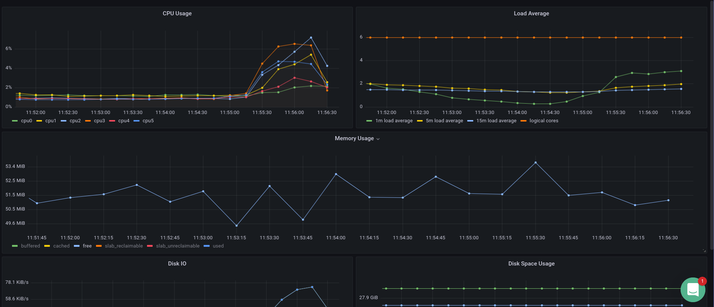
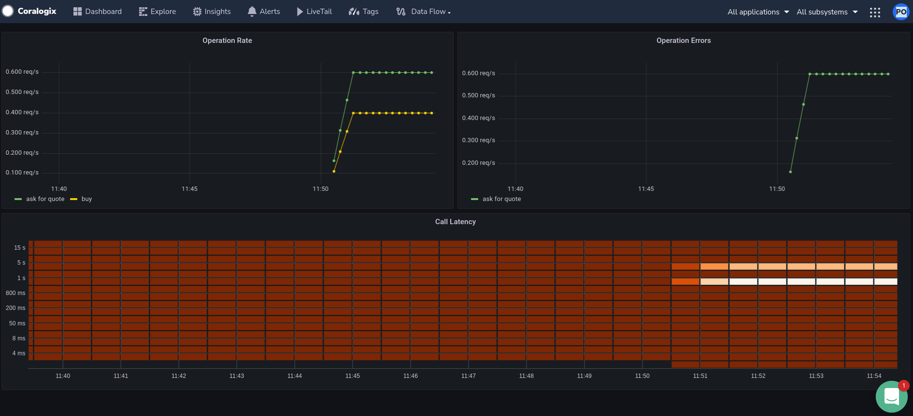
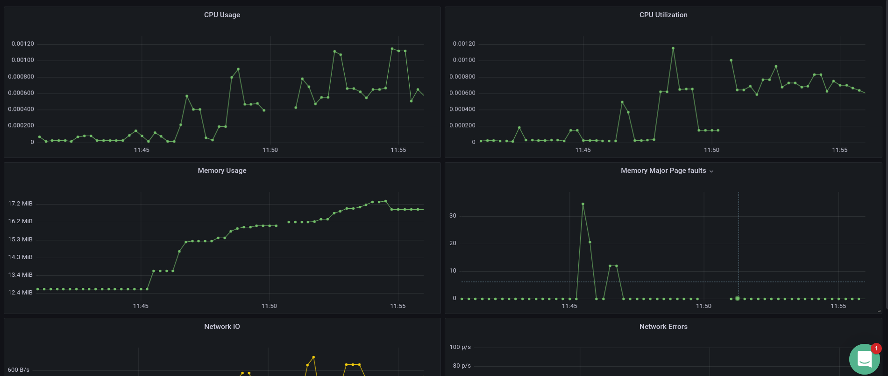
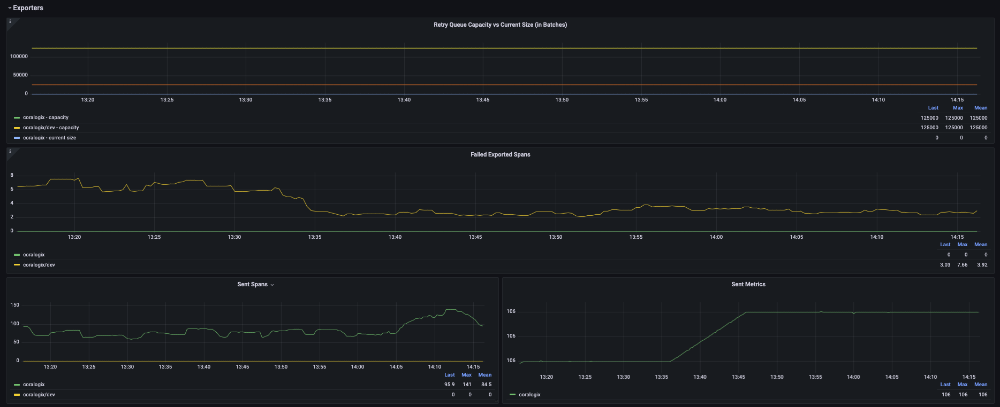

## Installation

* Copy the [otel-agent-dashboard.json](./assets/otel-agent-dashboard.json) file content
* Go to your hosted grafana
* Press the `Create` tab
* Press the `Import` tab
* Paste the copied content

### Host Metrics

### Span Metrics

### Kubernetes Pod

### Otel Agent

