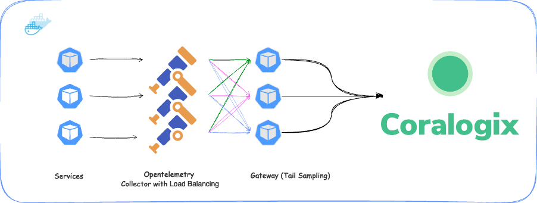

<!-- split path=&#34;kubernetes-observability/kubernetes-observability-using-opentelemetry/index.md&#34; -->

# Kubernetes observability using OpenTelemetry

Coralogix offers **Kubernetes Observability using OpenTelemetry** for comprehensive Kubernetes and application observability. Using our [OpenTelemetry Chart](https://github.com/coralogix/telemetry-shippers/tree/master/otel-integration/k8s-helm), the integration enables you to simplify the collection of logs, metrics, and traces from the running application in your pods to the cluster-level components of your Kubernetes cluster, while enabling our [Kubernetes Dashboard](https://coralogix.com/docs/user-guides/monitoring-and-insights/kubernetes-dashboard/kubernetes-dashboard/).

## Observability explained

### Kubernetes observability

Kubernetes observability is essential for monitoring a Kubernetes cluster's health, performance, resource utilization, and workloads. It involves collecting and analyzing metrics, logs and traces from the cluster and underlying machines to ensure the stability and optimal operation of the cluster.

When managing and monitoring Kubernetes components, consider these critical areas:

- **Cluster health**: Monitoring the overall health of the Kubernetes cluster is crucial. This includes checking the status and availability of the master and worker nodes and the control plane components such as the API server, kube-proxy, and scheduler.

- **Resource utilization**: Observing the resource utilization of cluster nodes and individual pods is essential for identifying bottlenecks, optimizing resource allocation, and ensuring efficient utilization of cluster resources. Extracting metrics and metadata from the underlying components provides the CPU, memory consumption, system load, and file system activity.

- **Networking**: Monitoring Kubernetes networking is crucial for smooth pod and service communication. This involves observing network traffic, latency, and error rates to detect and troubleshoot connectivity issues, identify performance bottlenecks, and improve network configurations.

- **Application performance**: Observing the performance of applications running on Kubernetes is essential for delivering a reliable and responsive user experience.

- **Logging and Tracing**. Logging and tracing play a vital role in understanding the behaviour and troubleshooting of Kubernetes components and applications. By collecting and analysing logs and traces, you can gain insights into system events, diagnose issues, and perform root cause analysis. Implementing effective logging and tracing strategies is important to capture relevant information for observability purposes.

### Application observability

Application observability focuses on monitoring and understanding the behavior of applications running on the Kubernetes cluster. It includes collecting and analyzing metrics, logs, and traces specific to the applications to gain insights into their performance and identify any issues or bottlenecks. This includes monitoring response times, throughput, error rates, and other application-specific metrics.

## OpenTelemetry integration overview

Integrating OpenTelemetry with Kubernetes enables comprehensive Kubernetes and application observability. The OpenTelemetry Integration Chart is a solution that combines two dependent charts into a single Helm installation for Kubernetes clusters: the OpenTelemetry Agent and the OpenTelemetry Cluster Collector. Both are built on the OpenTelemetry Collector Helm Chart, but are configured for optimal performance while collecting different data sources from Kubernetes. Together, they simplify the collection of logs, metrics, and traces from the running application in pods to the cluster-level components of your Kubernetes cluster.

Depending on your needs, you can use both charts (default behavior) or decide to disable either one under the `opentelemetry-agent` or `opentelemetry-cluster-collector` sections in the `values.yaml` file.

Additionally, the OpenTelemetry Integration chart enables the collection of telemetry data needed for the Kubernetes Dashboard setup. This dashboard is a powerful web-based interface for monitoring and managing Kubernetes clusters. It provides real-time CPU, memory, network, and disk usage metrics for nodes and pods. Users can track resource trends, optimize workload placement, and troubleshoot issues effectively. The dashboard also displays Kubernetes events for quick problem identification and resolution. Streamlining cluster management ensures efficient performance and smooth operation of applications.

## OpenTelemetry Agent

The OpenTelemetry Agent simplifies the collection of logs, metrics, and traces from applications running in your Kubernetes cluster. It is configured to deploy as a `daemonset` and runs on every node in the cluster. The agent maps metadata - such as Kubernetes attributes, Kubelet metrics, and host data - to the collected telemetry. This is particularly beneficial for high-traffic clusters or when utilizing our [APM capabilities](https://coralogix.com/docs/opentelemetry/integrations/apm-kubernetes/).

The agent comes with several pre-configured processors and receivers:

- [Coralogix Exporter](https://github.com/open-telemetry/opentelemetry-collector-contrib/tree/main/exporter/coralogixexporter). Coralogix Exporter automatically enriches telemetry data with Kubernetes attributes, using consistent ApplicationName and SubsystemName fields for better correlation across your telemetry signals.

- [Kubernetes Attributes Processor](https://github.com/open-telemetry/opentelemetry-collector-contrib/tree/main/processor/k8sattributesprocessor). This processor enriches data with Kubernetes metadata, such as pod and deployment information.

- [Kubernetes Log Collection](https://github.com/open-telemetry/opentelemetry-collector-contrib/tree/main/receiver/filelogreceiver). Enables native Kubernetes log collection with OpenTelemetry Collector, eliminating the need for multiple agents like Fluentd, Fluent Bit, or Filebeat.

- [Host Metrics](https://github.com/open-telemetry/opentelemetry-collector-contrib/tree/main/receiver/hostmetricsreceiver). native Linux monitor resource collection agent. No need to run Node exporter or vendor agents.

- [Kubelet Metrics](https://github.com/open-telemetry/opentelemetry-collector-contrib/tree/main/receiver/kubeletstatsreceiver). Fetches running container metrics from the local Kubelet.

- [OTLP Metrics](https://github.com/open-telemetry/opentelemetry-collector/blob/main/receiver/otlpreceiver/README.md). Sends application metrics using the OpenTelemetry protocol.

- Traces. Collects data in various formats such as [Jaeger](https://github.com/open-telemetry/opentelemetry-collector-contrib/tree/main/receiver/jaegerreceiver), [OpenTelemetry Protocol](https://github.com/open-telemetry/opentelemetry-collector/blob/main/receiver/otlpreceiver/README.md), or [Zipkin](https://github.com/open-telemetry/opentelemetry-collector-contrib/tree/main/receiver/zipkinreceiver).

- [Span Metrics](https://coralogix.com/docs/user-guides/apm/getting-started/span-metrics/). Converts optional traces into requests, duration, and error metrics using the span metrics processor.

- [Zpages Extension](https://github.com/open-telemetry/opentelemetry-collector/tree/main/extension/zpagesextension). Investigate latency and error issues by navigating to the pod's localhost:55516 web server. Relevant routes are described in the [OpenTelemetry documentation](https://github.com/open-telemetry/opentelemetry-collector/tree/main/extension/zpagesextension#exposed-zpages-routes).

## OpenTelemetry Cluster Collector

The OpenTelemetry Cluster Collector retrieves data from the cluster level, including Kubernetes events, cluster metrics, and additional Kubernetes-specific metrics. It enables you to gain insights into the health and performance of various objects within the cluster, such as deployments, nodes, and pods.

- [Coralogix Exporter](https://github.com/open-telemetry/opentelemetry-collector-contrib/tree/main/exporter/coralogixexporter). Coralogix Exporter automatically enriches telemetry data with Kubernetes attributes, using consistent ApplicationName and SubsystemName fields for better correlation across your telemetry signals.

- [Cluster Metrics Receiver](https://github.com/open-telemetry/opentelemetry-collector-contrib/tree/main/receiver/k8sclusterreceiver). The Kubernetes Cluster receiver collects cluster-level metrics from the Kubernetes API server.

- [Kubernetes Events Receiver](https://github.com/open-telemetry/opentelemetry-collector-contrib/tree/main/receiver/k8seventsreceiver) - The Kubernetes Events receiver collects events from the Kubernetes API server. See [Kubernetes Events](#kubernetes-events) for more information.

- Kubernetes Extra Metrics. This preset enables the collection of extra Kubernetes-related metrics, such as node information, pod status, or container I/O metrics. These metrics are collected in particular for the [Kubernetes Dashboard](https://coralogix.com/docs/user-guides/monitoring-and-insights/kubernetes-dashboard/kubernetes-dashboard/).

- [Integration Presets](https://github.com/coralogix/telemetry-shippers/tree/master/otel-integration/k8s-helm#integration-presets). This chart provides support to integrate with various applications (e.g. mysql) running on your cluster to monitor them out of the box.

## Kubernetes Dashboard

The OpenTelemetry Integration chart enables the collection of essential metrics needed for the [Kubernetes Dashboard](https://coralogix.com/docs/user-guides/monitoring-and-insights/kubernetes-dashboard/kubernetes-dashboard/) setup. The [Kubernetes Cluster Receiver](https://github.com/open-telemetry/opentelemetry-collector-contrib/tree/main/receiver/k8sclusterreceiver#kubernetes-cluster-receiver) is an essential part that provides cluster-level metrics and entity events from the Kubernetes API server. It can report real-time metrics of allocatable resource types such as CPU, memory, network and disk usage of nodes and pods and give an update on node conditions (e.g. `Ready`, `MemoryPressure`). As a whole, the metrics gathered are useful for the Kubernetes Dashboard to report on the health of your cluster.

> [!NOTE]
>
> **Please be aware** that certain metrics collected by the dashboard have high cardinality because of a high number of unique values for a given metric. This might result in higher costs because of metrics' ingestion and storage. This particularly applies to the following pod related metrics: `kube_pod_status_reason`, `kube_pod_status_phase` and `kube_pod_status_qos_class`.

If collecting these metrics is not required, you can disable them by setting `global.extensions.kubernetesDashboard.enabled` to `false` in the `values.yaml` file.

## Next steps

View our **basic configuration** instructions [here](https://coralogix.com/docs/opentelemetry/kubernetes-observability/kubernetes-complete-observability-basic-configuration/).

**Advanced configuration** instructions can be found [here](https://coralogix.com/docs/opentelemetry/kubernetes-observability/advanced-configuration/).

<!-- /split -->

<!-- split path=&#34;kubernetes-observability/kubernetes-complete-observability-basic-configuration/index.md&#34; -->

# Kubernetes Complete Observability: Basic configuration

Coralogix's **Kubernetes Complete Observability** provides a comprehensive solution for full-stack observability in your Kubernetes environment.

## Overview

View all of your nodes, pods and cluster metrics, pod logs, Kubernetes events, and your distributed traces pipeline. Take advantage of our Kubernetes Dashboard using our pre-configured OpenTelemetry Collector.

Utilizing [OpenTelemetry](https://coralogix.com/docs/opentelemetry/getting-started/), we ensure seamless and automated data collection from various components of your stack. This enables you to monitor infrastructure health and gain insights into application behavior and inter-service dependencies. Troubleshoot issues, optimize performance and manage your cluster more effectively with a 360-degree view of your Kubernetes ecosystem.

## Prerequisites

- [Kubernetes](https://kubernetes.io/) (v1.24+) installed
- [Helm](https://helm.sh/) (v3.9+) installed and configured

### Secret key

Follow the [private key tutorial](https://coralogix.com/docs/private-key/) to obtain your secret key.

The OpenTelemetry Agent requires a Kubernetes secret named `coralogix-keys`, which must contain your Coralogix [Send-Your-Data API key](https://coralogix.com/docs/user-guides/account-management/api-keys/send-your-data-api-key/) under the secret key `PRIVATE_KEY`. **This secret must exist in the same namespace where the Helm chart is installed**.

To create the secret, run the following command:

```bash
kubectl create secret generic coralogix-keys \
  --from-literal=PRIVATE_KEY=<private-key>
```

The created secret should look like this:

```yaml
apiVersion: v1
data:
  PRIVATE_KEY: <encrypted-private-key>
kind: Secret
metadata:
  name: coralogix-keys
  namespace: <the-release-namespace>
type: Opaque
```

## Installation

### UI-based installation

For UI-based installation check [Kubernetes Complete Observability](https://coralogix.com/docs/opentelemetry/kubernetes-observability/kubernetes-complete-observability-basic-configuration/).

### Helm-based installation

**STEP 1**. First, make sure to add our Helm charts repository to the local repos list with the following command:

```bash
helm repo add coralogix-charts-virtual https://cgx.jfrog.io/artifactory/coralogix-charts-virtual
```

**STEP 2**. In order to get the updated Helm charts from the added repository, run:

```bash
helm repo update
```

**STEP 3**. Install the chart:

```bash
helm upgrade --install otel-coralogix-integration coralogix-charts-virtual/otel-integration \
  --render-subchart-notes -f values.yaml
```

#### Providing custom array values for `extraEnvs`, `extraVolumes` or `extraVolumeMounts`

When providing custom overrides for array values like `extraEnvs`, `extraVolumes`, or `extraVolumeMounts`, note that Helm does not support array merging. Instead, arrays are completely overwritten (see this [issue](https://github.com/helm/helm/issues/3486) for details). To ensure proper configuration, first copy any existing array values from the provided [`values.yaml`](https://github.com/coralogix/telemetry-shippers/blob/master/otel-integration/k8s-helm/values.yaml) file before adding your custom values.

### OpenTelemetry Operator based installation - generating an OpenTelemetryCollector CRD

The OpenTelemetry Operator provides advanced capabilities like automatic collector upgrades and CRD-defined auto-instrumentation. To leverage these features, you can deploy the `otel-integration` using the Operator by generating an `OpenTelemetryCollector` Custom Resource Definition (CRD).

If you want to use the OpenTelemetry Integration Helm chart as an `OpenTelemetryCollector` CRD, you will need to have the OpenTelemetry Operator installed in your cluster. Please refer to the [OpenTelemetry Operator documentation](https://github.com/open-telemetry/opentelemetry-operator/blob/main/README.md) for full details.

We recommend to install the operator with the help of the community Helm charts from the [OpenTelemetry Helm Charts](https://github.com/open-telemetry/opentelemetry-helm-charts/tree/main/charts/opentelemetry-operator) repository.

**STEP 1**. First, make sure to add our Helm charts repository to the local repos list using the following command:

```bash
helm repo add coralogix-charts-virtual https://cgx.jfrog.io/artifactory/coralogix-charts-virtual
```

**STEP 2**. In order to get the updated Helm charts from the added repository, run:

```bash
helm repo update
```

**STEP 3**. Install the chart with the CRD `values-crd-override.yaml` file. You can provide the global values (such as secret key and cluster name) in one of two ways:

1. Adjust the main `values.yaml` file and pass it to the `helm upgrade` command as shown below:

```bash
helm upgrade --install otel-coralogix-integration coralogix-charts-virtual/otel-integration \
  --render-subchart-notes -f values.yaml -f values-crd-override.yaml
```

2. Provide the values directly through the command line by passing them with the `--set` flag:

```bash
helm upgrade --install otel-coralogix-integration coralogix-charts-virtual/otel-integration \
  --render-subchart-notes -f values-crd-override.yaml --set global.clusterName=<cluster_name> --set global.domain=<domain>
```

### Troubleshooting

During installation, you may encounter warning messages about missing namespace rules (`get`, `list`, `watch`). This is a known issue in OpenTelemetry (see [issue #2685](https://github.com/open-telemetry/opentelemetry-operator/issues/2685)) and does not impact the successful installation of the chart.

With some Helm versions (< `v3.14.3`), users might experience multiple warning messages during installation:

```
index.go:366: skipping loading invalid entry for chart "otel-integration" \<version> from \<path>: validation: more than one dependency with name or alias "opentelemetry-collector"
```

This is a known validation bug in Helm (see this [issue](https://github.com/helm/helm/issues/12748)). The warning messages do not impact the installation process, and the chart will be installed successfully. To avoid these warnings, we recommend upgrading to the latest Helm version or using a version that is not affected by this issue.

<!-- /split -->

<!-- split path=&#34;kubernetes-observability/advanced-configuration/index.md&#34; -->

# Kubernetes complete observability: Advanced configuration

Coralogix provides [Kubernetes Observability using OpenTelemetry](https://coralogix.com/docs/opentelemetry/kubernetes-observability/kubernetes-observability-using-opentelemetry/) for comprehensive monitoring of your Kubernetes clusters and applications. This guide explains advanced configuration options for optimizing your Kubernetes observability setup.

For basic configuration instructions, see our [basic configuration tutorial](https://coralogix.com/docs/opentelemetry/kubernetes-observability/kubernetes-complete-observability-basic-configuration/).

## Prerequisites

- [Kubernetes](https://kubernetes.io/) (version 1.24 or later) with [kubectl](https://kubernetes.io/docs/tasks/tools/#kubectl) command-line tool installed
- [Helm](https://helm.sh/) (version 3.9 or later) installed and configured

## Overview

The [OpenTelemetry Integration Chart](https://github.com/coralogix/telemetry-shippers/tree/master/otel-integration/k8s-helm) uses the [values.yaml](https://github.com/coralogix/telemetry-shippers/blob/master/otel-integration/k8s-helm/values.yaml) file as its default configuration. This configuration is based on the [OpenTelemetry Collector Configuration](https://opentelemetry.io/docs/collector/configuration/) for both the **OpenTelemetry Agent Collector** and **OpenTelemetry Cluster Collector**.

## Default configuration

**STEP 1**. Create a new YAML-formatted override file that defines values for the [OpenTelemetry Integration Chart](https://github.com/coralogix/telemetry-shippers/tree/master/otel-integration/k8s-helm).

The following global values are the minimum required configurations for a working chart:

```yaml
# values.yaml
global:
  domain: "<coralogix-endpoint>"
  clusterName: "<k8s-cluster-name>"
```

Configure these values:

- `domain`: Specify your [OpenTelemetry endpoint](https://coralogix.com/docs/integrations/coralogix-endpoints/) for the **domain** associated with your Coralogix account.
- `clusterName`: A required identifier for your cluster

You can also copy additional configurations from the repository [values.yaml](https://github.com/coralogix/telemetry-shippers/blob/master/otel-integration/k8s-helm/values.yaml) file.

> [!NOTE]
>
> If you want to override array values such as `extraEnvs`, `extraVolumes`, or `extraVolumeMounts`, note that Helm doesn't support array merging. Instead, arrays [are nulled out](https://github.com/helm/helm/issues/3486). If you need to customize these arrays, first copy the existing values from the provided [`values.yaml`](https://github.com/coralogix/telemetry-shippers/blob/master/otel-integration/k8s-helm/values.yaml) file.

**STEP 2**. Save this file as `values.yaml`

**STEP 3**. Install using the `helm upgrade --install` command:

```bash
helm upgrade --install otel-integration \
  coralogix-charts-virtual/otel-integration \
  -f values.yaml \
  -n $NAMESPACE
```

## Optional configurations

### Enabling dependent charts

The **OpenTelemetry Agent** is primarily used for collecting application telemetry, while the **OpenTelemetry Cluster Collector** is primarily used to collect cluster-level data. Depending on your requirements, you can either use the default configuration that enables both components, or you can choose to disable either of them by modifying the `enabled` flag in the `values.yaml` file under the `opentelemetry-agent` or `opentelemetry-cluster-collector` section as shown below:

```yaml
...
opentelemetry-agent:
  enabled: true
  mode: daemonset
...
opentelemetry-cluster-collector:
  enabled: true
  mode: deployment
```

## Installing the chart on clusters with mixed operating systems (Linux and Windows)

Installing `otel-integration` is also possible on clusters that support running Windows workloads on Windows node alongside Linux nodes (such as [EKS](https://docs.aws.amazon.com/eks/latest/userguide/windows-support.html), [AKS](https://learn.microsoft.com/en-us/azure/aks/windows-faq?tabs=azure-cli) or [GKE](https://cloud.google.com/kubernetes-engine/docs/how-to/creating-a-cluster-windows)). The collector will be installed on Linux nodes, as these components are supported only on Linux operating systems. Conversely, the agent will be installed on both Linux and Windows nodes as a daemonset, in order to collect metrics for both operating systems. In order to do so, the chart needs to be installed with few adjustments.

Depending on your Windows server version, you might need to adjust the image you are using with the Windows agent. The default image is `coralogixrepo/opentelemetry-collector-contrib-windows:<semantic_version>`. For Windows 2022 servers, use the `coralogixrepo/opentelemetry-collector-contrib-windows:<semantic_version>-windows2022` version. You can do this by adjusting the `opentelemetry-agent-windows.image.tag` value in the `values-windows.yaml` file.

Add the Coralogix Helm charts repository to your local repository list by running:

```bash
helm repo add coralogix-charts-virtual https://cgx.jfrog.io/artifactory/coralogix-charts-virtual
```

To update your local Helm repository cache with the latest charts, run:

```bash
helm repo update
```

Install the chart using the `values-windows.yaml` CRD file. You can provide the global values (secret key and cluster name) in one of two ways:

1. Edit the main `values.yaml` file and pass both files to the `helm upgrade` command:

```bash
helm upgrade --install otel-coralogix-integration coralogix-charts-virtual/otel-integration \
  --render-subchart-notes -f values.yaml -f values-windows.yaml
```

2. Provide the values directly in the command line by passing them with the `--set` flag:

```bash
helm upgrade --install otel-coralogix-integration coralogix-charts-virtual/otel-integration \
  --render-subchart-notes -f values-windows.yaml --set global.clusterName=<cluster_name> --set global.domain=<domain>
```

## OpenTelemetry Agent

The OpenTelemetry Agent is enabled and deployed as a `daemonset` by default. This creates an Agent pod per node. Allowing the collection of logs, metrics, and traces from application pods to be sent to OpenTelemetry pods hosted on the same node and spreads the ingestion load across the cluster. Be aware that the OpenTelemetry Agent pods consumes resources (e.g., CPU & memory) from each node on which it runs.

```yaml
opentelemetry-agent:
  enabled: true
  mode: daemonset
```

> [!NOTE]
>
> If there are nodes without a running OpenTelemetry Agent pod, the hosted pods of applications may be missing metadata attributes (e.g. node info and host name) in the telemetry sent.

### Agent presets

The multi-instanced OpenTelemetry Agent can be deployed across multiple nodes as a `daemonset`. It provides presets for collecting host metrics, Kubernetes attributes, and Kubelet metrics. When logs, metrics, and traces are generated from a pod, the collector enriches them with the metadata associated with the hosting machine. This metadata is very useful for linking infrastructure issues with performance degradation in services.

For more information on presets, refer to the documentation in [values.yaml](https://github.com/coralogix/opentelemetry-helm-charts/blob/main/charts/opentelemetry-collector/values.yaml#L129)

```yaml
# example
opentelemetry-agent:
...
  presets:
    # LogsCollection preset enables a configured filelog receiver to read all containers' logged console output (/var/log/pods/*/*/*.log).
    logsCollection:
      enabled: true
    # KubernetesAttributes preset collects Kubernetes metadata such as k8s.pod.name, k8s.namespace.name, and k8s.node.name. It also adjusts the ClusterRole with appropriate RBAC roles to query the Kubernetes API.
    kubernetesAttributes:
      enabled: true
    # HostMetrics preset enables collection of host metrics, involving CPU, memory, disk and network.
    hostMetrics:
      enabled: true
      # Process preset adds collection of host processes.
      process:
        enabled: true
    # KubeletMetrics enables the kubeletstats receiver to collect node, pod and container metrics from the Kubernetes API. It also adjusts the ClusterRole with appropriate RBAC roles.
    kubeletMetrics:
      enabled: true
```

For example, setting the `kubeletMetrics` preset to `true` will configure the `kubeletstats` receiver to pull node, pod, container, and volume metrics from the API server of the host's kubelet. The metrics will be sent to the metric pipeline.

```yaml
# example
receivers:
  kubeletstats:
    auth_type: serviceAccount
    collection_interval: 20s
    endpoint: ${K8S_NODE_NAME}:10250
    collect_all_network_interfaces:
      pod: true
      node: true
```

### Receivers

Once configured, you will be able to send logs, metrics, and traces to be collected in the **OpenTelemetry Agent** pods before exporting them to Coralogix.

To achieve this, you need to first [instrument your application](https://opentelemetry.io/docs/concepts/instrumenting/) with OpenTelemetry SDKs and expose the Collector to a corresponding [receiver](https://github.com/open-telemetry/opentelemetry-collector/tree/main/receiver). It is recommended to use the [OTLP receiver](https://github.com/open-telemetry/opentelemetry-collector/tree/main/receiver/otlpreceiver) (OpenTelemetry protocol) for transmission over gRPC or HTTP endpoints.

The `daemonset` deployment of the OpenTelemetry Agent also uses `hostPort` for the `otlp` port, allowing agent pod IPs to be reachable via node IPs, as follows:

```yaml
# K8s daemonset otlp port config
ports:
- containerPort: 4317
  hostPort: 4317
  name: otlp
  protocol: TCP
```

#### Configuring auto-instrumented JavaScript applications

The following examples demonstrate how to configure an [auto-instrumented JavaScript application](https://opentelemetry.io/docs/instrumentation/js/automatic/) to send traces to the agent pod's gRPC receiver.

**STEP 1**. Set the Kubernetes environment variables of the JavaScript application's deployment/pod as in the example below. Define the `OTEL_EXPORTER_OTLP_ENDPOINT` as the configured `NODE_IP` and `OTLP_PORT`. Configure `OTEL_TRACES_EXPORTER` to send in the `otlp` format. Choose `OTEL_EXPORTER_OTLP_PRO` as `grpc`.

```yaml
# kubernetes deployment manifest's env section
spec:
  containers:
  ...
  env:
  - name: NODE_IP
    valueFrom:
      fieldRef:
        fieldPath: status.hostIP
  - name: OTLP_PORT
    value: "4317"
  - name: OTEL_EXPORTER_OTLP_ENDPOINT
    value: "http://$(NODE_IP):$(OTLP_PORT)"
  - name: OTEL_TRACES_EXPORTER
    value: "otlp"
    - name: OTEL_EXPORTER_OTLP_PROTOCOL
    value: "grpc"

```

**STEP 2**. By default the agent has the otlp receiver configured as follows:

```yaml
# collector config
receivers:
  otlp:
    protocols:
      grpc:
        endpoint: ${MY_POD_IP}:4317
      http:
        endpoint: ${MY_POD_IP}:4318

```

> [!NOTE]
> - `${MY_POD_IP}` is a container environment variable that is mapped to the pod's IP address.
> - The agent is also preconfigured to collect data from `jaeger`.

### Processors

Processors are generally used to process logs, metrics, and traces before the data is exported. This may include, for example, modifying or altering attributes or sampling traces.

In the example below, a `k8sattributes` processor is used to automatically discover k8s resources (pods), extract metadata from them, and add the extracted metadata to the relevant logs, metrics, and spans as resource attributes.

```yaml
# default in values.yaml
processors:
    k8sattributes:
    filter:
      node_from_env_var: KUBE_NODE_NAME
    extract:
      metadata:
        - "k8s.namespace.name"
        - "k8s.deployment.name"
        - "k8s.statefulset.name"
        - "k8s.daemonset.name"
        - "k8s.cronjob.name"
        - "k8s.job.name"
        - "k8s.pod.name"
        - "k8s.node.name"

```

> [!NOTE]
> - The `k8sattributes` processor is enabled by default at the `preset` level as `kubernetesAttributes` and further extended in the default [`values`](https://github.com/coralogix/telemetry-shippers/blob/master/otel-agent/k8s-helm/values.yaml)[.](https://github.com/coralogix/telemetry-shippers/blob/master/otel-integration/k8s-helm/values.yaml)[`yaml`](https://github.com/coralogix/telemetry-shippers/blob/master/otel-integration/k8s-helm/values.yaml).
> - More information can be found in the [Kubernetes Attributes Processor README](https://github.com/open-telemetry/opentelemetry-collector-contrib/blob/main/processor/k8sattributesprocessor/README.md).

## OpenTelemetry Cluster Collector

Enable the `opentelemetry-cluster-collector` by setting `enabled` to `true`.

```yaml
opentelemetry-cluster-collector:
  enabled: true
  mode: deployment
```

> [!NOTE]
>
> The cluster collector operates as a `deployment` workload with a minimal replica of 1 to avoid duplication of telemetry data.

### Cluster collector presets

The cluster collector is best suited to enable [presets](https://github.com/open-telemetry/opentelemetry-helm-charts/tree/main/charts/opentelemetry-collector#configuration) such as Kubernetes Events and Cluster Metrics. A smaller instance count of the `deployment` is sufficient to query the Kubernetes API.

```yaml
  presets:
    clusterMetrics:
      enabled: true
    kubernetesEvents:
      enabled: true
    kubernetesExtraMetrics:
      enabled: true
```

For example, if you enable the `kubernetesEvents` preset, the [Kubernetes objects receiver](https://github.com/open-telemetry/opentelemetry-collector-contrib/tree/main/receiver/k8sobjectsreceiver) configuration will be added dynamically during the Helm installation. This configuration enables the collection of `events.k8s.io` objects from the Kubernetes API server.

## Kubernetes events: reducing the amount of collected data

When collecting Kubernetes events using the cluster collector, it is common for the number of events to reach millions, especially in large clusters with numerous nodes and constantly scaling applications. To collect only the relevant data, you can use the following settings.

### Cleaning data

By default, a transform processor named `transform/kube-events` is configured to remove unneeded fields from the collected Kubernetes events. You may override this or alter the fields as desired.

```yaml
processors:
  transform/kube-events:
    log_statements:
      - context: log
        statements:
          - keep_keys(body["object"], ["type", "eventTime", "reason", "regarding", "note", "metadata", "deprecatedFirstTimestamp", "deprecatedLastTimestamp"])
          - keep_keys(body["object"]["metadata"], ["creationTimestamp"])
          - keep_keys(body["object"]["regarding"], ["kind", "name", "namespace"])
```

### Filtering Kubernetes events

In large-scale environments, where there are numerous events occurring per hour, it may not be necessary to process all of them. In such cases, you can use an additional OpenTelemetry processor to filter out the events that do not need to be sent to Coralogix.

Below is a sample configuration for reference. This configuration filters out any event that has the field `reason` with one of those values `BackoffLimitExceeded|FailedScheduling|Unhealthy`.

```yaml
processors:
  filter/kube-events:
    logs:
      log_record:
        - 'IsMatch(body["reason"], "(BackoffLimitExceeded|FailedScheduling|Unhealthy)") == true'
```

### Collecting warning events only

Currently, Kubernetes has two different types of events: `Normal` and `Warning`. As we have the ability to filter events according to their type, you may choose to collect only `Warning` events, as these events are key to troubleshooting. One example could be the use of a filter processor to drop all unwanted `Normal`-type events.

```yaml
processors:
  filter/kube-events:
    logs:
      log_record:
        - 'IsMatch(body["object"]["type"], "Normal")'
```

## Resource Catalog

The Coralogix Resource Catalog can be used to monitor the various resource types within your Kubernetes clusters. It collects component details and lets you observe performance metrics and review logs of the associated components. Data for this feature comes from multiple sources. There are several presets that can be used to enable these features.

### Kubernetes resources preset

This preset enables the scrape of the Kubernetes API to populate your Kubernetes resource inventory. It uses the `k8sobjects` receiver and collects objects as defined in this configuration, uses a processor to enrich the collected objects, and exports it with a customized `coralogix/resource_catalog` exporter.

This preset needs to be enabled only in the cluster-collector configuration.

```yaml
  presets:
    kubernetesResources:
      enabled: true
```

### Host details presets

The last two presets collect important host information to enrich the catalog. This data is collected by the agent nodes and consists of host entity events and processes collected by `hostmetrics` receiver. While the `hostEntityEvents` preset is required, the `hostMetrics.process` preset is optional.

```yaml
  presets:
    hostEntityEvents:
      enabled: true
```

> [!NOTE]
> - The `hostMetrics` process preset is detailed in the Agent presets section above.
> - It is recommended to use the `hostMetric` preset only on agent collectors. Applying this preset to other collector types may result in duplicate host metrics.

## Kubernetes infrastructure monitoring

If you already have an existing log shipper (such as, [Fluentd](https://coralogix.com/docs/integrations/kubernetes/fluentd-helm-chart-for-kubernetes/), [Filebeat](https://coralogix.com/docs/integrations/kubernetes/kubernetes-with-filebeat/)) in place and your goal is to monitor all Kubernetes elements of your cluster, follow these steps to enable only the necessary collection of metrics and Kubernetes events to be sent to Coralogix.

**STEP 1**. Copy the following into a YAML-formatted override file and save as `values.yaml`.

```yaml
global:
  domain: "<coralogix-endpoint>"
  clusterName: "<k8s-cluster-name>"

opentelemetry-agent:
  presets:
    logsCollection:
      enabled: false
  config:
    exporters:
      logging: {}
    receivers:
      zipkin: null
      jaeger: null

    service:
      pipelines:
        traces:
          exporters:
            - logging
          receivers:
            - otlp
        logs:
          exporters:
            - logging
          receivers:
            - otlp
```

**STEP 2**. Install with the `helm upgrade --install` command.

```bash
helm upgrade --install otel-integration coralogix-charts-virtual/otel-integration -f values.yaml -n $NAMESPACE
```

## Installing the chart on GKE Autopilot clusters

GKE Autopilot has limited access to host filesystems, host networking and host ports. Due to this some features of OpenTelemetry Collector do not work. More information about limitations is available in [GKE Autopilot security capabilities document](https://cloud.google.com/kubernetes-engine/docs/concepts/autopilot-security)

Notable important differences from the regular `otel-integration` are:

- Host metrics receiver is not available, though you still get some metrics about the host through `kubeletstats` receiver.
- Kubernetes Dashboard does not work, due to missing Host Metrics.
- Host networking and host ports are not available, users need to send tracing spans through Kubernetes Service. The Service uses `internalTrafficPolicy: Local`, to send traffic to locally running agents.
- Log Collection works, but does not store check points. Restarting the agent will collect logs from the beginning.

To install otel-integration to GKE/Autopilot follow these steps:

First make sure to add our Helm charts repository to the local repos list with the following command:

```bash
helm repo add coralogix-charts-virtual https://cgx.jfrog.io/artifactory/coralogix-charts-virtual
```

In order to get the updated Helm charts from the added repository, please run:

```bash
helm repo update
```

Install the chart with the CRD `gke-autopilot-values.yaml` file. You can either provide the global values (secret key, cluster name) by adjusting the main `values.yaml` file and then passing the `values.yaml` file to the `helm upgrade` command as following:

```bash
helm upgrade --install otel-coralogix-integration coralogix-charts-virtual/otel-integration \
  --render-subchart-notes -f values.yaml -f gke-autopilot-values.yaml
```

Or you can provide the values directly in the command line by passing them with the `--set` flag:

```bash
helm upgrade --install otel-coralogix-integration coralogix-charts-virtual/otel-integration \
  --render-subchart-notes -f gke-autopilot-values.yaml --set global.clusterName=<cluster_name> --set global.domain=<domain>
```

### Installing the chart on IPv6-only clusters

To run otel-integration inside an IPv6-only cluster, you need to install the chart using the `ipv6-values.yaml` file.

First, make sure to add our Helm charts repository to the local repo list using the following command:

```bash
helm repo add coralogix-charts-virtual https://cgx.jfrog.io/artifactory/coralogix-charts-virtual
```

To get the updated Helm charts from the added repository, run:

```bash
helm repo update
```

Install the chart with the `ipv6-values.yaml` file. You can either provide the global values (secret key, cluster name) by adjusting the main `values.yaml` file and then passing the `values.yaml` file to the `helm upgrade` command as follows:

```bash
helm upgrade --install otel-coralogix-integration coralogix-charts-virtual/otel-integration \
  --render-subchart-notes -f values.yaml -f ipv6-values.yaml
```

### Installing the chart on EKS Fargate clusters

AWS EKS Fargate is a serverless compute engine for Kubernetes that removes the need to provision and manage EC2 instances. Since Fargate pods run in an isolated environment, some collector features require special configuration.

#### Prerequisites

Before installing the chart on EKS Fargate, ensure the following:

1. **CoreDNS addon**: The EKS cluster must have the CoreDNS addon installed for DNS resolution to work. If your cluster doesn't have CoreDNS, install it using:

   ```bash
   CLUSTER_VERSION=$(aws eks describe-cluster --name <cluster-name> --region <region> --query 'cluster.version' --output text)
   COREDNS_VERSION=$(aws eks describe-addon-versions --addon-name coredns --kubernetes-version $CLUSTER_VERSION --region <region> --query 'addons[0].addonVersions[0].addonVersion' --output text)
   aws eks create-addon --cluster-name <cluster-name> --addon-name coredns --addon-version $COREDNS_VERSION --region <region>
   ```

2. **Fargate Profile**: A Fargate profile must be created for the namespace where you plan to deploy the collectors. If you're deploying to the `default` namespace, create a Fargate profile:

   ```bash
   aws eks create-fargate-profile \
     --cluster-name <cluster-name> \
     --region <region> \
     --fargate-profile-name default \
     --pod-execution-role-arn <pod-execution-role-arn> \
     --subnets <subnet-id-1> <subnet-id-2> <subnet-id-3> \
     --selectors namespace=default
   ```

3. **VPC DNS Settings**: Ensure DNS support and DNS hostnames are enabled for your VPC:

   ```bash
   aws ec2 modify-vpc-attribute --vpc-id <vpc-id> --enable-dns-support
   aws ec2 modify-vpc-attribute --vpc-id <vpc-id> --enable-dns-hostnames
   ```

Notable important differences from the regular `otel-integration` are:

- Host metrics receiver is not available, though you still get some metrics about the host through `kubeletstats` receiver.
- Host networking and host ports are not available, users need to send tracing spans through Kubernetes Service.
- Log collection via hostPath mounts is not supported due to Fargate limitations.
- The collector requires the `K8S_NODE_NAME` environment variable to be set for proper node identification and kubelet stats collection.

#### Deployment Modes

There are two primary deployment patterns for EKS Fargate:

1. **Per-namespace collector** (`opentelemetry-agent-eks-fargate`): Deploy the OpenTelemetry Collector as a StatefulSet in each Fargate namespace where your applications run. This collector will collect your application's telemetry data (traces, metrics, and logs) and also gather kubelet stats metrics from its own Fargate node. This is the recommended approach when you want to deploy the collector alongside your applications in Fargate.

2. **Centralized monitoring collector** (`opentelemetry-agent-eks-fargate-monitoring`): Deploy a dedicated OpenTelemetry Collector as a Deployment that acts as a centralized infrastructure monitoring component. This collector automatically discovers all Fargate nodes in the cluster and collects kubelet stats metrics from each of them. It uses the receiver creator to dynamically discover kubelet endpoints and filters metrics to only collect from Fargate nodes. This pattern is useful when you want to monitor the infrastructure separately from application telemetry, or when you want a single collector to gather node-level metrics across all Fargate pods in the cluster.

   **Why is this needed?** Due to Fargate networking restrictions, a pod cannot communicate with its own kubelet endpoint to collect its own metrics. The per-namespace collector uses an init container to label its node with `OTEL-collector-node=true`, and the centralized monitoring collector specifically targets nodes with this label to collect the missing kubelet stats metrics. This workaround ensures complete infrastructure monitoring coverage across all Fargate nodes.

#### Installation

First, make sure to add our Helm charts repository to the local repo list using the following command:

```bash
helm repo add coralogix-charts-virtual https://cgx.jfrog.io/artifactory/coralogix-charts-virtual
```

To get the updated Helm charts from the added repository, run:

```bash
helm repo update
```

Install the chart with the `values-eks-fargate.yaml` file. You must provide the required global values (`clusterName` and `domain`). You can either adjust the main `values.yaml` file with these values and then pass it to the `helm upgrade` command:

```bash
helm upgrade --install otel-coralogix-integration coralogix-charts-virtual/otel-integration \
  --render-subchart-notes -f values.yaml -f values-eks-fargate.yaml
```

Or you can provide the values directly in the command line by passing them with the `--set` flag:

```bash
helm upgrade --install otel-coralogix-integration coralogix-charts-virtual/otel-integration \
  --render-subchart-notes -f values-eks-fargate.yaml \
  --set global.clusterName=<cluster_name> \
  --set global.domain=<coralogix-endpoint>
```

> [!NOTE]
> The `global.domain` value must be set to your [Coralogix endpoint domain](https://coralogix.com/docs/integrations/coralogix-endpoints/) (e.g., `coralogix.com`, `coralogix.us`, `coralogix.in`, etc.). If you have the domain stored in the `CORALOGIX_DOMAIN` environment variable, you can use `--set global.domain=$CORALOGIX_DOMAIN`.

#### Configuration

The `values-eks-fargate.yaml` file enables both deployment modes by default. To use only one mode, you can disable the other:

- To use only the per-namespace collector, set `opentelemetry-agent-eks-fargate-monitoring.enabled: false` in your values file.
- To use only the centralized monitoring collector, set `opentelemetry-agent-eks-fargate.enabled: false` in your values file.

The EKS Fargate preset configuration is nested under each collector's configuration. For the per-namespace collector (`opentelemetry-agent-eks-fargate`):

```yaml
opentelemetry-agent-eks-fargate:
  presets:
    eksFargate:
      # Set to false for per-namespace collectors
      monitoringCollector: false
      kubeletStats:
        # Collection interval for kubelet stats metrics
        collectionInterval: "30s"
      initContainer:
        enabled: true
        image:
          repository: "public.ecr.aws/aws-cli/aws-cli"
          tag: "2.28.17"
```

For the centralized monitoring collector (`opentelemetry-agent-eks-fargate-monitoring`):

```yaml
opentelemetry-agent-eks-fargate-monitoring:
  presets:
    eksFargate:
      # Set to true for centralized monitoring collector
      monitoringCollector: true
      kubeletStats:
        # Collection interval for kubelet stats metrics
        collectionInterval: "30s"
```

#### Required Environment Variables

When using EKS Fargate, the `K8S_NODE_NAME` environment variable is automatically configured in each collector's configuration. For example, in `opentelemetry-agent-eks-fargate`:

```yaml
opentelemetry-agent-eks-fargate:
  extraEnvs:
    - name: K8S_NODE_NAME
      valueFrom:
        fieldRef:
          fieldPath: spec.nodeName
```

The same configuration is also present in `opentelemetry-agent-eks-fargate-monitoring`. This variable is used by the resource detection processor to identify the node and by the receiver creator to collect kubelet stats.

Note: Due to Fargate limitations, these options will not work:
- `presets.hostMetrics`
- `presets.logsCollection` (container log collection via hostPath mounts)

### Next steps

**Validation** instructions can be found [here](https://coralogix.com/docs/opentelemetry/kubernetes-observability/validation/).

## Tail Sampling with OpenTelemetry using Kubernetes

This tutorial demonstrates how to configure a Kubernetes cluster, deploy OpenTelemetry to collect logs, metrics, and traces, and enable trace sampling. We will cover an example of enabling a tail sample for the Opentelemetry Demo Application and a more precise example using the small trace-generating application.

## Prerequisites

- A Kubernetes cluster

- Helm installed

- Coralogix [Send-Your-Data API key](https://coralogix.com/docs/user-guides/account-management/api-keys/send-your-data-api-key/)



## How it works

The Kubernetes OpenTelemetry Integration consists of the following components:

- **OpenTelemetry Agent**. The Agent is deployed to each node within the Cluster and collects telemetry data from the applications running on that node. The agent is configured to send the telemetry data to the OpenTelemetry Gateway. The agent ensures that traces with the same ID are sent to the same gateway. This allows tail sampling to be performed on the traces correctly, even if they span multiple applications and nodes.

- **OpenTelemetry Gateway**. The Gateway is responsible for receiving telemetry data from the agents and forwarding it to the Coralogix backend. The Gateway is also responsible for load balancing the telemetry data to the Coralogix backend.

## Install the Coralogix OpenTelemetry Integration

This integration uses the [Coralogix OpenTelemetry Helm Chart](https://github.com/coralogix/telemetry-shippers/tree/master/otel-integration/k8s-helm). While this document focuses on tail sampling for traces, deploying this chart also deploys the infrastructure to collect logs, metrics, and traces from your Kubernetes cluster and pods.

The following configuration enables OTel-agent pods to send span data to the coralogix-opentelemetry-gateway deployment using the [loadbalancing exporter](https://github.com/open-telemetry/opentelemetry-collector-contrib/tree/main/exporter/loadbalancingexporter).

To ensure optimal performance:

- Configure an appropriate number of replicas based on your traffic volume
- Set resource requests and limits to handle the expected load
- Define custom [tail sampling policies](https://github.com/open-telemetry/opentelemetry-collector-contrib/tree/main/processor/tailsamplingprocessor) to control which spans are collected.

> [!NOTE]
> - When running in OpenShift environments, set `distribution: "openshift"` in your `values.yaml`
> - When running in Windows environments, use the `values-windows-tailsampling.yaml` values file

**STEP 1**. Add the Coralogix Helm repository.

```bash
helm repo add coralogix-charts-virtual https://cgx.jfrog.io/artifactory/coralogix-charts-virtual
```

**STEP 2**. Copy the `tail-sampling-values.yaml` file found [here](https://github.com/coralogix/telemetry-shippers/blob/master/otel-integration/k8s-helm/tail-sampling-values.yaml) and update the relevant fields with your values.

```yaml
global:
  domain: "<your-coralogix-domain>"
  clusterName: ""
  defaultApplicationName: "otel"
  defaultSubsystemName: "integration"
  logLevel: "warn"
  collectionInterval: "30s"

opentelemetry-agent:
  enabled: true
  mode: daemonset
  presets:
    loadBalancing:
      enabled: true
      routingKey: "traceID"
      hostname: coralogix-opentelemetry-gateway

  config:
    service:
      pipelines:
        traces:
          exporters:
            - loadbalancing

opentelemetry-gateway:
  enabled: true
  replicaCount: 3

  config:
    processors:
      tail_sampling:
        decision_wait: 10s
        num_traces: 100
        expected_new_traces_per_sec: 10
        policies:
          [
            {
              name: errors-policy,
              type: status_code,
              status_code: {status_codes: [ERROR]}
            },
            {
              name: randomized-policy,
              type: probabilistic,
              probabilistic: {sampling_percentage: 10}
            },
          ]

opentelemetry-collector:
  enabled: false

```

**STEP 3**. Add your Coralogix [Send-Your-Data API key](https://coralogix.com/docs/user-guides/account-management/api-keys/send-your-data-api-key/) to the `tail-sampling-values.yaml` file.

```bash
kubectl create secret generic coralogix-keys --from-literal 'PRIVATE_KEY=<your-private-key>'
```

**STEP 4**. Install the `otel-integration`.

```
helm upgrade --install otel-coralogix-integration coralogix-charts-virtual/otel-integration \
  --render-subchart-notes -f tail-sampling-values.yaml
```

```bash
kubectl get pods
NAME                                               READY   STATUS    RESTARTS   AGE
coralogix-opentelemetry-agent-86qdb                1/1     Running   0          7h59m
coralogix-opentelemetry-gateway-65dfbb5567-6rk4j   1/1     Running   0          7h59m
coralogix-opentelemetry-gateway-65dfbb5567-g7m5l   1/1     Running   0          7h59m
coralogix-opentelemetry-gateway-65dfbb5567-zbprd   1/1     Running   0          7h59m

```

You should end up with as many opentelemetry-agent pods as you have nodes in your cluster, and 3 opentelemetry-gateway pods.

## Install test application environment

In the next section, we will describe the process for installing 2 application environments, the OpenTelemetry Demo Application and a Small Trace Generating. You do not need to install both these examples.

### Install OpenTelemetry demo

**STEP 1**. Add the Helm chart for the OpenTelemetry Demo Application.

```bash
helm repo add open-telemetry https://open-telemetry.github.io/opentelemetry-helm-charts
```

**STEP 2**. Create a `values.yaml` file and add the following:

```yaml
default:
  env:
    - name: OTEL_SERVICE_NAME
      valueFrom:
        fieldRef:
          apiVersion: v1
          fieldPath: "metadata.labels['app.kubernetes.io/component']"
    - name: OTEL_COLLECTOR_NAME
      value: '{{ '{{' }} include "otel-demo.name" . }}-otelcol'
    - name: OTEL_EXPORTER_OTLP_ENDPOINT
      value: http://$(OTEL_COLLECTOR_NAME):4317
    - name: OTEL_EXPORTER_OTLP_METRICS_TEMPORALITY_PREFERENCE
      value: cumulative
    - name: OTEL_RESOURCE_ATTRIBUTES
      value: service.name=$(OTEL_SERVICE_NAME),service.namespace=opentelemetry-demo

  envOverrides:
    - name: OTEL_COLLECTOR_NAME
      valueFrom:
        fieldRef:
          apiVersion: v1
          fieldPath: spec.nodeName
    - name: OTEL_EXPORTER_OTLP_ENDPOINT
      value: http://$(OTEL_COLLECTOR_NAME):4317

serviceAccount:
  create: true
  annotations: {}
  name: ""

opentelemetry-collector:
  enabled: false

jaeger:
  enabled: false

prometheus:
  enabled: false

grafana:
  enabled: false

```

This will configure the OpenTelemetry Demo Application to send traces to the Coralogix OpenTelemetry Agent running on the node.

**STEP 3**. Install the Opentelemetry Demo Application.

```bash
helm install otel-demo open-telemetry/opentelemetry-demo -f values.yaml

NAME: my-otel-demo
LAST DEPLOYED: Mon Feb 19 23:29:16 2024
NAMESPACE: default
STATUS: deployed
REVISION: 1
TEST SUITE: None
NOTES:

```

### Install the small trace-generating application

This application is a small trace-generating application. We will demonstrate how to connect it to the Coralogix OpenTelemetry Agent to enable tail sampling.

**STEP 1**. Create a file `go-traces-demo.yaml` and add the following:

```yaml
apiVersion: apps/v1
kind: Deployment
metadata:
  name: go-otel-traces-demo
spec:
  selector:
    matchLabels:
      app: go-otel-traces-demo
  replicas: 1
  template:
    metadata:
      labels:
        app: go-otel-traces-demo
    spec:
      containers:
        - name: go-otel-traces-demo
          image: public.ecr.aws/c1s3k2h4/go-otel-traces-demo:latest
          imagePullPolicy: Always
          env:
            - name: NODE_IP
              valueFrom:
                fieldRef:
                  fieldPath: status.hostIP
            - name: CX_ENDPOINT
              value: $(NODE_IP):4317

```

**STEP 2**. Apply the Kubernetes deployment.

```
kubectl apply -f go-traces-demo.yaml
```

## Validation

View your telemetry data in your Coralogix dashboard. Traces should arrive from the tail-sampling load balancer.

## Configuring Head Sampling for Tracing

Head sampling is a feature that allows you to sample traces at the collection point. When enabled, it creates a separate pipeline for sampled traces using probabilistic sampling. This helps reduce the volume of traces while maintaining a representative sample.

When used in combination with tail sampling, head sampling is applied first at the agent level. The sampled traces are then forwarded to the tail sampling collectors, where additional sampling decisions can be made. This means that tail sampling will only see and process the traces that have already passed through head sampling.

The sampling configuration:

- Creates a new 'traces/sampled' pipeline in addition to the main traces pipeline
- Applies probabilistic sampling based on the configured percentage
- Supports different sampling modes:
  - "proportional": Maintains the relative proportion of traces across services
  - "equalizing": Attempts to sample equal numbers of traces from each service
  - "hash_seed": Uses consistent hashing to ensure the same traces are sampled

To enable head sampling, configure the following in your values.yaml:

```yaml
presets:
  headSampling:
    enabled: true
    # Percentage of traces to sample (0-100)
    percentage: 10
    # Sampling mode - "proportional", "equalizing", "hash_seed"
    mode: "proportional"
```

## Deploying Central Collector Cluster for Tail Sampling

To deploy OpenTelemetry Collector in a separate "central" Kubernetes cluster for telemetry collection and [tail sampling](https://opentelemetry.io/docs/concepts/sampling/#tail-sampling) using OpenTelemetry Protocol (OTLP) receivers, install `otel-integration` using the `central-tail-sampling-values.yaml` values file. Review the values file for detailed configuration options.

This deployment creates two key components:

- `opentelemetry-receiver`. Receives OTLP data and sends metrics and logs directly to Coralogix while performing load balancing of span data sent to the `opentelemetry-gateway` deployment.
- `opentelemetry-gateway`. Performs tail sampling decisions on the received span data before forwarding to Coralogix

To enable other Kubernetes clusters to send data to the `opentelemetry-receiver`, expose it using one of these methods:

- Service of type LoadBalancer
- Ingress object configuration
- Manual load balancer configuration

> [!IMPORTANT]
>
> Ensure you configure sufficient replicas and appropriate resource requests/limits to handle the expected load. You'll also need to set up custom [tail sampling processor](https://github.com/open-telemetry/opentelemetry-collector-contrib/tree/main/processor/tailsamplingprocessor) policies.

**STEP 1**. Run the following commands to deploy the Central Collector Cluster.

```bash
helm repo add coralogix-charts-virtual https://cgx.jfrog.io/artifactory/coralogix-charts-virtual
```

```
helm upgrade --install otel-coralogix-central-collector coralogix-charts-virtual/otel-integration \
  --render-subchart-notes -f central-tail-sampling-values.yaml
```

**STEP 2**. Validate the deployment by sending a sample of OTLP data to the `opentelemetry-receiver` Service and navigating to the Coralogix Explore Screen to view collected traces. This can be done via `telemetrygen`:

```bash
kubectl apply -f - <<EOF
apiVersion: apps/v1
kind: Deployment
metadata:
  name: telemetrygen-deployment
spec:
  replicas: 1
  selector:
    matchLabels:
      app: telemetrygen
  template:
    metadata:
      labels:
        app: telemetrygen
    spec:
      containers:
      - name: telemetrygen
        image: ghcr.io/open-telemetry/opentelemetry-collector-contrib/telemetrygen:latest
        args:
          - "traces"
          - "--otlp-endpoint=coralogix-opentelemetry-receiver:4317"
          - "--otlp-insecure"
          - "--rate=10"
          - "--duration=120s"
EOF
```

**STEP 3**. Configure a regular `otel-integration` deployment to send data to the Central Collector Cluster:

```bash
helm upgrade --install otel-coralogix-integration coralogix-charts-virtual/otel-integration \
  --render-subchart-notes -f central-agent-values.yaml
```

## Troubleshooting

### Why am I getting ResourceExhausted errors when using Tail Sampling?

Typically, the errors look like this:

```
not retryable error: Permanent error: rpc error: code = ResourceExhausted desc = grpc: received message after decompression larger than max (5554999 vs. 4194304)
```

By default, the OTLP Server has a [4MiB size limit](https://pkg.go.dev/google.golang.org/grpc#MaxRecvMsgSize) for a single gRPC request. This limit may be exceeded when the `opentelemetry-agent` sends trace data to the gateway's OTLP Server using the load balancing exporter. To resolve this, increase the size limit by adjusting the [configuration](https://github.com/open-telemetry/opentelemetry-collector/blob/main/config/configgrpc/README.md#server-configuration). For example:

```
receivers:
  otlp:
    protocols:
      grpc:
        max_recv_msg_size_mib: 20
```

### Additional Resources

|                    |                                                                                                                                                                        |
|--------------------|------------------------------------------------------------------------------------------------------------------------------------------------------------------------|
| Documentation      | [Introduction to Tail Sampling with Coralogix & OpenTelemetry](https://coralogix.com/docs/opentelemetry/tail-sampling/tail-sampling-with-coralogix-and-opentelemetry/) |
| OTLP Configuration | [OTLP Receiver Configuration](https://github.com/open-telemetry/opentelemetry-collector/blob/main/receiver/otlpreceiver/README.md)                                     |

## Target Allocator and Prometheus Operator with OpenTelemetry

### Overview

Targets are endpoints that supply metrics via the Prometheus data model. For the Prometheus Receiver to scrape them, they can be statically configured via the `static_configs` parameters or dynamically discovered using one of the supported service discovery mechanisms.

The OpenTelemetry [Target Allocator](https://opentelemetry.io/docs/kubernetes/operator/target-allocator/) for Kubernetes, an optional component of the [OpenTelemetry Operator](https://opentelemetry.io/docs/kubernetes/operator/) now included in Coralogix's [OpenTelemetry Integration Helm Chart](https://github.com/coralogix/telemetry-shippers/tree/master/otel-integration/k8s-helm), facilitates service discovery and manages the configuration of targets into the different agent collector's [Prometheus Receiver](https://github.com/open-telemetry/opentelemetry-collector-contrib/blob/main/receiver/prometheusreceiver/README.md) across nodes.

If you're using the Prometheus Operator custom resources (`ServiceMonitor` and `PodMonitor`) and want to continue using them with the OpenTelemetry collector, you can enable target scraping through the Target Allocator component. This optional feature is disabled by default but can be enabled by setting `opentelemetry-agent.targetAllocator.enabled: true` in your `values.yaml` file.

When enabled, the target allocator is deployed as a separate deployment in the same namespace as the collector. It allocates targets to the agent collector on each node, enabling scraping of targets that reside on that specific node - effectively implementing a simple sharding mechanism. For high availability, you can run multiple target allocator instances by setting `opentelemetry-agent.targetAllocator.replicas` to a value greater than 1.

You can customize the scrape interval for Prometheus Custom Resources by configuring `opentelemetry-agent.targetAllocator.prometheusCR.scrapeInterval`. If not specified, it defaults to `30s`.

For more details on Prometheus custom resources and target allocator see the documentation [here](https://github.com/open-telemetry/opentelemetry-operator/tree/main/cmd/otel-allocator#discovery-of-prometheus-custom-resources).

### Discovery

The Target Allocator discovers [Prometheus Operator](https://github.com/prometheus-operator/prometheus-operator/tree/main) Custom Resources, namely the ServiceMonitor and PodMonitor as Metrics Targets. These metrics targets detail the endpoints of exportable metrics available on the Kubernetes cluster as "jobs."

Then, the Target Allocator detects available OpenTelemetry Collectors and distributes the targets among known collectors. As a result, the collectors routinely query the Target Allocator for their assigned metric targets to add to the scrape configuration.

### Allocation strategies

Upon query from collectors, the Target Allocator assigns metric endpoint targets according to a chosen allocation strategy. To align with our chart's Opentelemetry agent in DaemonSet mode, the allocation strategy `per node` is preconfigured. This assigns each target to the OpenTelemetry collector running on the same Node as the metric endpoint.

### Monitoring CRDs (ServiceMonitor & PodMonitor)

As part of the deployment model under the [Prometheus Operator](https://github.com/prometheus-operator/prometheus-operator), concepts were introduced to simplify the configuration aspects of monitoring to align them with the capabilities of Kubernetes better.

Specifying endpoints under the monitoring scope as CRD objects:

- Deployment in YAML files and packaging as Helm Charts or custom resources.

- Decouples and de-centralises the monitoring configuration making it more agile for software changes and progression.

- Reduces impact across monitored components for changes as there is no single standard file or resource to work with. Any different workload will continue to work.

Both ServiceMonitor and PodMonitor use selectors to detect pods or services to monitor with additional configurations on how to scrape them (*e.g., port, interval, path*).

#### ServiceMonitor

A ServiceMonitor provides metrics from the service itself and each of its endpoints. This means each pod implementing the service will be discovered and scraped.

```yaml
apiVersion: monitoring.coreos.com/v1
kind: ServiceMonitor
metadata:
  labels:
    serviceMonitorSelector: prometheus
  name: prometheus
  namespace: prometheus
spec:
  endpoints:
  - interval: 30s
    targetPort: 9090
    path: /metrics
  namespaceSelector:
    matchNames:
    - prometheus
  selector:
    matchLabels:
      target-allocation: "true"

```

Details:

- `endpoints`: Defines an endpoint serving Prometheus metrics to be scraped by Prometheus. It specifies an interval, port, URL path, and scrape timeout duration. See the [Endpoints spec](https://github.com/prometheus-operator/prometheus-operator/blob/main/Documentation/api-reference/api.md#monitoring.coreos.com/v1.Endpoint).

- `selector` & `namespaceSelector`: Selectors for labels and namespaces from which the Kubernetes Endpoints objects will be discovered.

More details on writing the ServiceMonitor can be found in the [ServiceMonitor Spec](https://github.com/prometheus-operator/prometheus-operator/blob/main/Documentation/api-reference/api.md#monitoring.coreos.com/v1.ServiceMonitor).

#### PodMonitor

For workloads that cannot be exposed behind a service, a PodMonitor is used instead.

This includes:

- Services that are not HTTP-based, e.g. Kafka, SQS/SNS, JMS, etc.

- Components such as CronJobs, DaemonSets, etc (e.g. using hostPort)

```yaml
apiVersion: monitoring.coreos.com/v1
kind: PodMonitor
metadata:
  name: front-end
  labels:
    name: front-end
spec:
  namespaceSelector:
    matchNames:
      - prometheus
  selector:
    matchLabels:
      name: front-end
  podMetricsEndpoints:
  - targetPort: 8079
```

Details:

- `podMetricsEndpoints` : Similar to `endpoint`, this defines the pod endpoint serving Prometheus metrics. See [PodMetricsEndpoint spec](https://github.com/prometheus-operator/prometheus-operator/blob/main/Documentation/api-reference/api.md#monitoring.coreos.com/v1.PodMetricsEndpoint).

### Prerequisites

- [Kubernetes](https://kubernetes.io/) (v1.24+)

- The command-line tool [kubectl](https://kubernetes.io/docs/tasks/tools/#kubectl)

- [Helm](https://helm.sh/) (v3.9+) installed and configured

- CRDs for PodMonitors and ServiceMonitors installed.

Check that Custom Resource Definitions for PodMonitors and ServiceMonitors exist in your cluster using this command:

```
kubectl get crd | grep monitoring

```


If not, you can install them with the following `kubectl apply` commands:

```bash
kubectl apply -f https://raw.githubusercontent.com/prometheus-operator/prometheus-operator/main/example/prometheus-operator-crd/monitoring.coreos.com_podmonitors.yaml
kubectl apply -f https://raw.githubusercontent.com/prometheus-operator/prometheus-operator/main/example/prometheus-operator-crd/monitoring.coreos.com_servicemonitors.yaml
```

### Installation

The Target Allocator can be enabled by modifying the default [values.yaml](https://github.com/coralogix/telemetry-shippers/blob/master/otel-agent/k8s-helm/values.yaml) file in the [OpenTelemetry Integration Chart](https://github.com/coralogix/telemetry-shippers/tree/master/otel-integration/k8s-helm). Once enabled, it is deployed to service the Prometheus Receivers of the OpenTelemetry Agent Collectors and allocate targets residing on the DaemonSet's nodes.

This guide assumes you have running services exporting Prometheus metrics running in your Kubernetes cluster.

**STEP 1.** Follow the instructions for Kubernetes Observability with OpenTelemetry, specifically the [Advanced Configuration guide](https://coralogix.com/docs/opentelemetry/kubernetes-observability/advanced-configuration/), which utilizes the otel-integration [values.yaml](https://github.com/coralogix/telemetry-shippers/blob/master/otel-agent/k8s-helm/values.yaml) file by setting `opentelemetry-agent.targetAllocator.enabled` to `true`:

```yaml
opentelemetry-agent:
  targetAllocator:
    enabled: true   ##set to true
    replicas: 1
    allocationStrategy: "per-node"
    prometheusCR:
      enabled: true
```

Also, as shown above, the default allocation strategy is `per node` to align with the OpenTelemetry agent's daemon set mode.

**STEP 2.** Install the Helm chart with the changes made to the [values.yaml](https://github.com/coralogix/telemetry-shippers/blob/master/otel-agent/k8s-helm/values.yaml) and deploy the target allocator pod:

```
helm upgrade --install otel-coralogix-integration coralogix-charts-virtual/otel-integration --render-subchart-notes -n <namespace> -f values.yaml
```


## Troubleshooting

To check if the jobs and scrape configs generated by the Target Allocator are correct and ServiceMonitors and PodMonitors are successfully detected, port-forward to the Target Allocator's exposed service. The information will be available under the `/jobs` and `/scrape_configs` HTTP paths.

The Target Allocators service can be located with the following command: `kubectl get svc -n <namespace>`

Port forward to the target allocator pod with the following `kubectl` command:

```
kubectl port-forward -n <namespace> svc/coralogix-opentelemetry-targetallocator 8080:8080
```

You can browse or curl the `/jobs` and `/scrape_configs` endpoints for the detected PodMonitor & ServiceMonitor resources and the generated scrape configs.


The generated `kubernetes_sd_configs` is a common configuration syntax for discovering and scraping Kubernetes targets in Prometheus.

## Opentelemetry EBPF Instrumentation

The [OpenTelemetry EBPF Instrumentation](https://github.com/open-telemetry/opentelemetry-ebpf-instrumentation) is an OpenTelemetry component that uses eBPF to collect telemetry data from the Linux kernel, such as network metrics and spans, without requiring modifications to the application code. To enable the OpenTelemetry EBPF Instrumentation, set `opentelemetry-ebpf-instrumenat.enabled` to `true` in the `values.yaml` file.

for a full list of values for this chart, please look at [values.yaml](https://github.com/coralogix/opentelemetry-helm-charts/blob/main/charts/opentelemetry-ebpf-instrumentation/values.yaml)

### K8s Cache

The OpenTelemetry EBPF Instrumentation includes a K8s Cache component that collects Kubernetes metadata and enriches the telemetry data with Kubernetes labels. This allows you to correlate the telemetry data with Kubernetes resources, such as Pods, Nodes, and Namespaces. The K8s Cache Component is critical for large scale kubernetes clusters, as it allows takes load of the K8s API Server by isolating the calls to only the K8s Cache services. The K8s Cache is turned on by default, with 2 replicas for high availability. You can configure the number of replicas by setting `opentelemetry-ebpf-instrumentation.k8sCache.replicas` in the `values.yaml` file. to turn off the K8s Cache, set `opentelemetry-ebpf-instrumentation.k8sCache.replicas` to `0` in the `values.yaml` file. Turning off the k8s cache will still enrich data with k8s metadata, but it will do so by calling the K8s API Server directly from each replica of the OpenTelemetry EBPF Instrumentation.

## Coralogix Operator

The [Coralogix Operator](https://github.com/coralogix/coralogix-operator) provides Kubernetes-native deployment and management for Coralogix, designed to simplify and automate the configuration of Coralogix APIs through Kubernetes custom resources definitions and controllers.

### Enabling Coralogix Operator

To enable the Coralogix Operator, set `coralogix-operator.enabled` to `true` in the `values.yaml` file.

<!-- /split -->

<!-- split path=&#34;kubernetes-observability/how-to-use-it/index.md&#34; -->

# How to use it

## Metrics

Please refer to the following documentation for the full list of metrics and their labels, collected from various sources:

- [Kubernetes Cluster Receiver](https://github.com/open-telemetry/opentelemetry-collector-contrib/blob/main/receiver/k8sclusterreceiver/documentation.md)
- [Kubelet Stats Receiver](https://github.com/open-telemetry/opentelemetry-collector-contrib/blob/main/receiver/kubeletstatsreceiver/metadata.yaml)
- [Host Metrics Receiver](https://github.com/open-telemetry/opentelemetry-collector-contrib/tree/main/receiver/hostmetricsreceiver)

Additionally, [k8sattributes processor](https://github.com/open-telemetry/opentelemetry-collector-contrib/tree/main/processor/k8sattributesprocessor) and [resource detection processor](https://github.com/open-telemetry/opentelemetry-collector-contrib/tree/main/processor/resourcedetectionprocessor) are used to add more metadata labels.

[Prometheus receiver](https://github.com/open-telemetry/opentelemetry-collector-contrib/blob/main/receiver/prometheusreceiver/README.md) is used to scrape Kubernetes API Server and [Kubelet cAdvisor](https://kubernetes.io/docs/concepts/cluster-administration/system-metrics/) endpoints for display in the [Kubernetes Dashboard](https://coralogix.com/docs/user-guides/monitoring-and-insights/kubernetes-dashboard/kubernetes-dashboard/).

> [!NOTE]
>
> OpenTelemetry metrics are converted to Prometheus format following the [OpenTelemetry specification](https://opentelemetry.io/docs/specs/otel/compatibility/prometheus_and_openmetrics/#otlp-metric-points-to-prometheus)

## Custom Metrics

In addition to standard metrics, the OpenTelemetry Integration provides the following custom metrics:

### kube_pod_status_qos_class

Provides information about the Pod QOS class.

| Metric Type | Value | Labels |
|-------------|-------|--------|
| Gauge       | 1     | reason |

### kube_pod_status_reason

Provides information about the Kubernetes Pod Status.

| Metric Type | Value | Labels |
|-------------|-------|--------|
| Gauge       | 1     | reason |

Example reason label keys: Evicted, NodeAffinity, NodeLost, Shutdown, UnexpectedAdmissionError

### kube_node_info

Provides information about the Kubernetes Node.

| Metric Type | Value | Labels              |
|-------------|-------|---------------------|
| Gauge       | 1     | k8s.kubelet.version |

### k8s.container.status.last_terminated_reason

Provides information about Pod's last termination.

| Metric Type | Value | Labels |
|-------------|-------|--------|
| Gauge       | 1     | reason |

Example reason label keys: OOMKilled

### kubernetes_build_info

Provides information about the Kubernetes version.

### Container Filesystem usage metrics

- container_fs_writes_total
- container_fs_reads_total
- container_fs_writes_bytes_total
- container_fs_reads_bytes_total
- container_fs_usage_bytes

### CPU throttling metrics

- container_cpu_cfs_periods_total
- container_cpu_cfs_throttled_periods_total

## Available Endpoints

Applications can send OTLP Metrics and Jaeger, Zipkin and OTLP traces to the local nodes, as `otel-agent` is using hostNetwork .

| Protocol              | Port  |
|-----------------------|-------|
| Zipkin                | 9411  |
| Jaeger GRPC           | 6832  |
| Jaeger Thrift binary  | 6832  |
| Jaeger Thrift compact | 6831  |
| Jaeger Thrift http    | 14268 |
| OTLP GRPC             | 4317  |
| OTLP HTTP             | 4318  |

### Example application environment configuration

The following code creates a new environment variable (`NODE`) containing the node's IP address and then uses that IP in the `OTEL_EXPORTER_OTLP_ENDPOINT` environment variable. This ensures that each instrumented pod will send data to the local OTEL collector on the node it is currently running on.

```yaml
  env:
  - name: NODE
    valueFrom:
      fieldRef:
        fieldPath: status.hostIP
  - name: OTEL_EXPORTER_OTLP_ENDPOINT
    value: "http://$(NODE):4317"
```

### About global collection interval

The global collection interval (`global.collectionInterval`) is the interval in which the collector will collect metrics from the configured receivers. For most optimal default experience, we recommend using the 30 second interval set by the chart. However, if you'd prefer to collect metrics more (or less) often, you can adjust the interval by changing the `global.collectionInterval` value in the `values.yaml` file. The minimal recommended global interval is `15s`. If you wish to use default value for *each* component set internally by the collector, you can remove the collection interval parameter from presets completely.

Beware that using lower interval will result in more metric data points being sent to the backend, thus resulting in more costs. Note that the choice of the interval also has an effect on behavior of rate functions, for more see [here](https://www.robustperception.io/what-range-should-i-use-with-rate/).

### About batch sizing

[Batch processor](https://github.com/open-telemetry/opentelemetry-collector/tree/main/processor/batchprocessor) ensures that the telemetry being sent to Coralogix backend is batched into bigger requests, ensuring lower networking overhead and better performance. The batching processor is enabled by default and we strongly recommend to use it. By default, the `otel-integration` chart uses the following recommended settings for batch processors in all collectors:

```yaml
    batch:
      send_batch_size: 1024
      send_batch_max_size: 2048
      timeout: "1s"
```

These settings imposes a hard limit of 2048 units (spans, metrics, logs) on the batch size, ensuring a balance between the recommended size of the batches and networking overhead.

You may adjust these settings according to your needs, but when configuring the batch processor by yourself, it is important to be mindful of the size limites imposed by the Coraloigx endpoints (currently **max. 10 MB** after decompression - see [documentation](https://coralogix.com/docs/opentelemetry/#limits--quotas)).

More information on how to configure the batch processor can be found [here](https://github.com/open-telemetry/opentelemetry-collector/tree/main/processor/batchprocessor#batch-processor).

### About span metrics

The collector provides a possibility to synthesize R.E.D (Request, Error, Duration) metrics based on the incoming span data. This can be useful to obtain extra metrics about the operations you have instrumented for tracing. For more information, please refer to the [OpenTelemetry Collector documentation](https://github.com/open-telemetry/opentelemetry-collector-contrib/blob/main/connector/spanmetricsconnector/README.md).

This feature is enabled by default and can be disabled by setting the `spanmetrics.enabled` value to `false` in the `values.yaml` file.

Beware that enabling the feature will result in creation of additional metrics. Depending on how you instrument your applications, this can result in a significant increase in the number of metrics. This is especially true for cases where the span name includes specific values, such as user IDs or UUIDs. Such instrumentation practice is [strongly discouraged](https://github.com/open-telemetry/opentelemetry-specification/blob/main/specification/trace/api.md#span).

In such cases, we recommend to either correct your instrumentation or to use the `spanMetrics.spanNameReplacePattern` parameter, to replace the problematic values with a generic placeholder. For example, if your span name corresponds to template `user-1234`, you can use the following pattern to replace the user ID with a generic placeholder. See the following configuration:

```yaml
spanNameReplacePattern:
- regex: "user-[0-9]+"
  replacement: "user-{id}"
```

This will result in your spans having generalized name `user-{id}`.

#### SpanMetrics Error Tracking

Once you enable the Span Metrics preset, the errorTracking configuration will automatically be enabled.

This is how you can disable the errorTracking option:

```yaml
presets:
  spanMetrics:
    enabled: true
    errorTracking:
      enabled: false
```

> [!NOTE] The `errorTracking` feature works only with OpenTelemetry SDKs that support OpenTelemetry Semantic Conventions version v1.21.0 or later. If you are using an older SDK version, you may need to transform certain attributes (for example, `http.status_code` to `http.response.status_code`).
>
> To perform this transformation, add the following configuration:
>
> ```yaml
> presets:
>   spanMetrics:
>     enabled: true
>     transformStatements:
>     - set(attributes["http.response.status_code"], attributes["http.status_code"]) where attributes["http.response.    status_code"] == nil
>     errorTracking:
>       enabled: true
> ```

#### SpanMetrics Database Monitoring

Once you enable the Span Metrics preset, the `dbMetrics`` configuration will automatically be enabled. It generates RED (Request, Errors, Duration) metrics for database spans. For example, query `db_calls_total` to view generated request metrics.

This is needed to enable the [Database Monitoring](https://coralogix.com/docs/user-guides/apm/features/database-monitoring/) feature inside Coralogix APM.

This is how you can disable the `dbMetrics` option:

```yaml
presets:
  spanMetrics:
    enabled: true
    dbMetrics:
      enabled: false
```

The `dbMetrics` also support transform statements that will apply only to database traces. Here's how you can use it:

```yaml
presets:
  spanMetrics:
    enabled: true
    dbMetrics:
      enabled: true
      transformStatements:
      - replace_pattern(attributes["db.query.text"], "\\d+", "?") # removes potential IDs for the attribute
      - set(attributes["span.duration_ns"], span.end_time_unix_nano - span.start_time_unix_nano) # stores the span duration in ns in an attribute
```

##### Note on Semantic Conventions for old OTEL SDKs

The `dbMetrics` preset only works with OpenTelemetry SDKs that support OpenTelemetry Semantic conventions v1.26.0.

| Language      | SDK version with `dbMetrics` support |
|---------------|--------------------------------------|
| Go            | v1.28.0+                             |
| Java          | v1.41.0+                             |
| JavaScript    | v1.26.0+                             |
| Python        | v1.26.0+                             |
| .NET          | v1.10.0+                             |
| C++           | v1.16.0+                             |
| PHP           | v1.0.0+                              |
| Ruby          | v1.4.0+                              |
| Rust          | v0.25.0+                             |
| Swift         | v1.10.0+                             |
| Erlang/Elixir | v1.3.0+                              |

If you are using older versions, you might need to transform some attributes, such as:

```
db.sql.table => db.collection.name
db.mongodb.collection => db.collection.name
db.cosmosdb.container => db.collection.name
db.cassandra.table => db.collection.name
```

To do that, you can add the configuration below. It will take care of defining the `transform/spanmetrics` processor with those transform statements and adding it to the end of the `traces` pipeline, just before batching. This ensures that the transformations are applied to all spans before they are routed to the `spanmetrics` or `forward/db` connectors, putting all the spans on the same semantic convention.

> [!IMPORTANT] Correlation might be broken if the transform statements below are applied only at the `dbMetrics` level.

```yaml
    spanMetrics:
      enabled: true
      transformStatements:
      - set(attributes["db.namespace"], attributes["db.name"]) where attributes["db.namespace"] == nil
      - set(attributes["db.namespace"], attributes["server.address"]) where attributes["db.namespace"] == nil
      - set(attributes["db.namespace"], attributes["network.peer.name"]) where attributes["db.namespace"] == nil
      - set(attributes["db.namespace"], attributes["net.peer.name"]) where attributes["db.namespace"] == nil
      - set(attributes["db.namespace"], attributes["db.system"]) where attributes["db.namespace"] == nil
      - set(attributes["db.operation.name"], attributes["db.operation"]) where attributes["db.operation.name"] == nil
      - set(attributes["db.collection.name"], attributes["db.sql.table"]) where attributes["db.collection.name"] == nil
      - set(attributes["db.collection.name"], attributes["db.cassandra.table"]) where attributes["db.collection.name"] == nil
      - set(attributes["db.collection.name"], attributes["db.mongodb.collection"]) where attributes["db.collection.name"] == nil
      - set(attributes["db.collection.name"], attributes["db.redis.database_index"]) where attributes["db.collection.name"] == nil
      - set(attributes["db.collection.name"], attributes["db.elasticsearch.path_parts.index"]) where attributes["db.collection.name"] == nil
      - set(attributes["db.collection.name"], attributes["db.cosmosdb.container"]) where attributes["db.collection.name"] == nil
      - set(attributes["db.collection.name"], attributes["aws_dynamodb.table_names"]) where attributes["db.collection.name"] == nil
      dbMetrics:
        enabled: true
```

#### Span metrics with different buckets per application

If you want to use Span Metrics connector with different buckets per application you need to use `spanMetricsMulti` preset. For example:

```yaml
  presets:
    spanMetricsMulti:
      enabled: false
      defaultHistogramBuckets: [1ms, 4ms, 10ms, 20ms, 50ms, 100ms, 200ms, 500ms, 1s, 2s, 5s]
      configs:
        - selector: route() where attributes["service.name"] == "one"
          histogramBuckets: [1s, 2s]
        - selector: route() where attributes["service.name"] == "two"
          histogramBuckets: [5s, 10s]
```

For selector you need to write a [OTTL](https://github.com/open-telemetry/opentelemetry-collector-contrib/blob/main/pkg/ottl/README.md) statement, more information is available in [routing connector docs](https://github.com/open-telemetry/opentelemetry-collector-contrib/tree/main/connector/routingconnector).

### Multi-line log configuration

This helm chart supports multi-line configurations for different namespace, pod, and/or container names. The following example configuration applies a specific firstEntryRegex for a container which is part of a x Pod in y namespace:

```yaml
  presets:
    logsCollection:
      enabled: true
      multilineConfigs:
        - namespaceName:
            value: kube-system
          podName:
            value: app-a.*
            useRegex: true
          containerName:
            value: http
          firstEntryRegex: ^[^\s].*
          combineWith: ""
        - namespaceName:
            value: kube-system
          podName:
            value: app-b.*
            useRegex: true
          containerName:
            value: http
          firstEntryRegex: ^[^\s].*
          combineWith: ""
        - namespaceName:
            value: default
          firstEntryRegex: ^[^\s].*
          combineWith: ""

```

This feature uses [filelog receiver's](https://github.com/open-telemetry/opentelemetry-collector-contrib/blob/main/receiver/filelogreceiver/README.md) [router](https://github.com/open-telemetry/opentelemetry-collector-contrib/blob/main/pkg/stanza/docs/operators/router.md) and [recombine](https://github.com/open-telemetry/opentelemetry-collector-contrib/blob/main/pkg/stanza/docs/operators/recombine.md) operators.

Alternatively, you can add a recombine filter at the end of log collection operators using `extraFilelogOperators` field. The following example adds a single recombine operator for all Kubernetes logs:

```yaml
  presets:
    logsCollection:
      enabled: true
      extraFilelogOperators:
        - type: recombine
          combine_field: body
          source_identifier: attributes["log.file.path"]
          is_first_entry: body matches "^(YOUR-LOGS-REGEX)"
```

### Integrating Kube State Metrics

You can configure otel-integration to collect Kube State Metrics metrics. Using Kube State Metrics is useful when missing metrics or labels in the Kubernetes Cluster Receiver. Kube State Metrics collects Kubernetes cluster-level metrics that are crucial for monitoring resource states, like pods, deployments, and HorizontalPodAutoscalers (HPAs). To integrate with Kube State Metrics, create a file called `values-ksm.yaml`, and there configure the metrics and labels that you wish to collect:

```yaml
metricAllowlist:
  - kube_horizontalpodautoscaler_labels
  - kube_horizontalpodautoscaler_spec_max_replicas
  - kube_horizontalpodautoscaler_status_current_replicas
  - kube_pod_info
  - kube_pod_labels
  - kube_pod_container_status_waiting
  - kube_pod_container_status_waiting_reason
metricLabelsAllowlist:
  - pods=[app,environment]
  - horizontalpodautoscalers=[app,environment]
```

Then install Kube State Metrics:

```bash
helm repo add prometheus-community https://prometheus-community.github.io/helm-charts
helm repo update

helm install kube-state-metrics prometheus-community/kube-state-metrics --values values-ksm.yaml
```

This command adds the Prometheus community's Helm repository and installs Kube State Metrics using the values you've configured.

Next, configure opentelemetry-cluster-collector to scrape Kube State Metrics via Prometheus receiver.

```bash
helm upgrade --install otel-coralogix-integration coralogix-charts-virtual/otel-integration . --values values-cluster-ksm.yaml
```

Once the installation is complete, verify that the Kube State Metrics are being scraped and ingested inside Coralogix.

### Connecting to Coralogix fleet management

The integration connects to the Coralogix fleet management server through fleetManagement preset. This connection happens through the OpAMP extension of the Collector and the endpoint used is: `https://ingress.<CORALOGIX_DOMAIN>/opamp/v1`. This feature is enabled by default. You can disable it by setting the `presets.fleetManagement.enabled` property to `false`.

> [!NOTE] Important security considerations when enabling this feature:
> - Because this extension shares your Collector's configuration with the fleet management server, it's important to ensure that any secret contained in it is using the environment variable expansion syntax.
> - The default capabilities of the OpAMP extension **do not** include remote configuration or packages.
> - By default, the extension will pool the server every 2 minutes. Additional network requests might be made between the server and the Collector, depending on the configuration on both sides.

To enable this feature, set the `presets.fleetManagement.enabled` property to `true`. Here is an example `values.yaml`:

```yaml
presets:
  fleetManagement:
    enabled: true
```

#### Known errors

When running on Windows, you might see the "failed getting host info" error. This is expected behavior because the collector attempts to retrieve Windows metadata from the Windows Registry, which is only possible when running from HostProcess Windows containers. This error has no negative impact on the functionality of the Collector or OpAMP in any way.

Example:

```
"msg":"failed getting host info","otelcol.component.id":"opamp","otelcol.component.kind":"Extension","error":"The system cannot find the file specified.","
```

<!-- /split -->

<!-- split path=&#34;kubernetes-observability/troubleshooting/index.md&#34; -->

# Troubleshooting

## Limits & quotas

- Coralogix places a **hard limit of 10MB** of data to our [**OpenTelemetry Endpoints**](https://coralogix.com/docs/integrations/coralogix-endpoints/), with a **recommendation of 2MB**.
- Metric names must be a maximum of 255 characters.
- Attribute keys for metric data must be a maximum of 255 characters.

## Metrics

You can enhance metric telemetry collection using the `level` field. The following is a list of all possible values and their explanations:

- "none" indicates that no telemetry data should be collected
- "basic" is recommended and covers the basics of service telemetry
- "normal" adds additional indicators on top of the basic level
- "detailed" adds dimensions and views to the previous levels

For example:

```yaml
service:
  telemetry:
    metrics:
      level: detailed
      address: ":8888"
```

This adds more metrics around exporter latency and various processor metrics.

### Prometheus Receiver

If you are missing metrics collected by the Prometheus receiver, make sure to check Collector logs.

The Prometheus receiver typically logs `Failed to scrape Prometheus endpoint` errors with target information when it fails to collect the application metrics.

For example:

```
message_obj:{
level:warn
ts:2024-12-13T08:19:17.809Z
caller:internal/transaction.go:129
msg:Failed to scrape Prometheus endpoint
kind:receiver
name:prometheus
data_type:metrics
scrape_timestamp:1734077957789
target_labels:{__name__="up", container="main", endpoint="4001",  namespace="namespace", pod="pod-name"}
}
```

The generic error doesn't tell you much. To get more details, you will need to enable debug logs inside the Collector:

```yaml
global:
  logLevel: "debug"
```

Then you will start seeing the actual metrics and errors in Collector logs, which will help you troubleshoot the issue further.

#### Common errors

`invalid sample: non-unique label names` - Metric contains non-unique label names. For example:

```yaml
metric{label1="value1",label1="value2"}
```

This is not allowed in Prometheus / [OpenMetrics](https://github.com/prometheus/OpenMetrics/blob/main/specification/OpenMetrics.md#labelset), but some libraries produce such labels. It is best to fix the application or library. But as a workaround, you can fix it with [metric_relabel_configs](https://prometheus.io/docs/prometheus/latest/configuration/configuration/#metric_relabel_configs), which gets executed before the metric is ingested.

For example, you drop the `label1` metric:

```yaml
metric_relabel_configs:
  - action: labeldrop
    regex: 'label1'
```

Alternatively, you can replace the metric with itself, leaving only single label:

```yaml
metric_relabel_configs:
  - action: replace
    source_labels: ['label1']
    target_label: label1
```

`'le' label on histogram metric is missing or empty.` Histogram metric contains multiple types. Typically, the metric library produces invalid metrics that are both a histogram and a summary, which is not allowed in Prometheus / OpenMetrics. For example:

```
# HELP http_server_requests_seconds
# TYPE http_server_requests_seconds histogram
http_server_requests_seconds_bucket{le="0.025",} 1
http_server_requests_seconds_count{} 15.0
http_server_requests_seconds_sum{} 0.20938292
...
http_server_requests_seconds{quantile="0.999",} 0.0
```

It is best to fix the application or library to produce just histogram. But as a workaround, you can fix it with `metric_relabel_config`. The following example will drop metrics with quantile label:

```yaml
metric_relabel_configs
 - sourceLabels: [__name__, quantile]
   regex: http_server_requests_seconds;.*
   action: drop
```

## Traces

OpenTelemetry Collector has an ability to send it's own traces using OTLP exporter. You can send the traces to OTLP server running on the same OpenTelemetry Collector, so it goes through configured pipelines. For example:

```
service:
  telemetry:
    traces:
      processors:
        batch:
          exporter:
            otlp:
              protocol: grpc/protobuf
              endpoint: ${env:MY_POD_IP}:4317
```

<!-- /split -->

<!-- split path=&#34;kubernetes-observability/filtering-and-reducing-costs/index.md&#34; -->

# Filtering and reducing costs

The Otel integration has a couple of ways you can reduce costs of telemetry data. One simple way is to enable the `reduceResourceAttributes` preset, which removes the following list of resource attributes that are typically not used:

- azure.resourcegroup.name
- azure.vm.name
- azure.vm.scaleset.name
- azure.vm.size
- cloud.account.id
- cloud.availability_zone
- cloud.platform
- cloud.provider
- cloud.region
- container.id
- cx.otel_integration.name
- faas.id
- faas.instance
- faas.name
- faas.version
- gcp.cloud_run.job.execution
- gcp.cloud_run.job.task_index
- gcp.gce.instance_group_manager.name
- gcp.gce.instance_group_manager.region
- gcp.gce.instance_group_manager.zone
- host.image.id
- host.type
- k8s.cronjob.uid
- k8s.daemonset.uid
- k8s.deployment.uid
- k8s.hpa.uid
- k8s.job.uid
- k8s.namespace.uid
- k8s.node.uid
- k8s.pod.start_time
- k8s.pod.uid
- k8s.replicaset.uid
- k8s.statefulset.uid
- os.type
- os.version
- process.command
- process.command_line
- process.command_args
- process.executable.name
- process.executable.path
- process.owner
- process.pid
- process.parent_pid
- process.runtime.description
- process.runtime.name
- process.runtime.version
- net.host.name
- net.host.port
- telemetry.distro.name (only removed from metrics and logs)
- telemetry.distro.version (only removed from metrics and logs)
- telemetry.sdk.language (only removed from metrics and logs)
- telemetry.sdk.name (only removed from metrics and logs)
- telemetry.sdk.version (only removed from metrics and logs)

Kubernetes resource attributes are typically coming from [Kubernetes Attributes Processor](https://github.com/open-telemetry/opentelemetry-collector-contrib/blob/main/processor/k8sattributesprocessor/README.md) and [Kubernetes Cluster receiver](https://github.com/open-telemetry/opentelemetry-collector-contrib/tree/main/receiver/k8sclusterreceiver).

While `net.host.name` and `net.host.port` is coming from Prometheus receiver, instead of using these attributes you can use the `service.instance.id` attribute, which has a combination of host and port.

Additionally, the `reduceLogAttributes` preset removes the following log record attributes that are typically not used:

- log.iostream
- log.file.path
- logtag
- time (only a timestamp, raw nanoseconds epoch time is still present)

Coralogix recommends new customers to enable these two presets by default. Existing customers should consider enabling them on new deployments after analyzing the potential impact in alerts and dashboards that they already have.

**Important disclaimer:** the default denylists in these presets can change between versions of the integration. If stability is important you should consider customizing them. Any change to the lists will be announced in the changelog and you can recheck them at any time.

## Custom filtering of attributes

The `reduceResourceAttributes` preset supports a custom denylist of attributes per pipeline. You can customize the denylists per signal like so:

```yaml
presets:
  reduceResourceAttributes:
    enabled: true
    pipelines: ["metrics", "traces", "logs"] # the "all" pipeline is also supported
    denylist:
     metrics:
      - custom_attribute_1
      - custom_attribute_2
    traces:
      - custom_attribute_1
      - custom_attribute_2
    logs:
      - custom_attribute_1
      - custom_attribute_2
```

Note that when customizing the denylists you are completely overriding the default one. This means that if you just want to append a few attributes to it, you will have to repeat the default ones.

## Custom filtering of log record attributes

The `reduceLogAttributes` preset supports a custom denylist of log record attributes. You can customize the denylist like so:

```yaml
presets:
  reduceLogAttributes:
    enabled: true
    denylist:
      - custom_attribute_1
      - custom_attribute_2
```

Note that when customizing the denylist you are completely overriding the default one. This means that if you just want to append a few attributes to it, you will have to repeat the default ones.

## Custom filtering of metrics

Alternatively, you can also use include / exclude filters to collect only metrics about needed objects. For example, the following configuration allows you to exclude `kube-*` and `default` namespace Kubernetes metrics. This filtering is available on many [mdatagen](https://github.com/open-telemetry/opentelemetry-collector/tree/main/cmd/mdatagen) based receiver.

For example:

```yaml
receivers:
  k8s_cluster:
    collection_interval: 10s
    allocatable_types_to_report: [cpu, memory]
    resource_attributes:
      k8s.namespace.name:
        metrics_exclude:
          - regexp: kube-.*
          - strict: default
```

## Dropping data using processors

Alternatively you can use [OpenTelemetry Transformation Language](https://github.com/open-telemetry/opentelemetry-collector-contrib/blob/main/pkg/ottl/README.md) with [filter](https://github.com/open-telemetry/opentelemetry-collector-contrib/tree/main/processor/filterprocessor) processor to filter out unneeded data. The following example drops metrics named `my.metric` and any metrics with resource where attribute `my_label` equals `abc123`:

```yaml
processors:
  filter/ottl:
    error_mode: ignore
    metrics:
      metric:
        - name == "my.metric"
        - resource.attributes["my_label"] == "abc123"
```

<!-- /split -->

<!-- split path=&#34;kubernetes-observability/performance-of-the-collector/index.md&#34; -->

# Performance of the Collector

## Picking the right tracing SDK span processor

OpenTelemetry tracing SDK supports two strategies to create an application traces, a "SimpleSpanProcessor" and a "BatchSpanProcessor. While the SimpleSpanProcessor submits a span every time a span is finished, the BatchSpanProcessor processes spans in batches, and buffers them until a flush event occurs. Flush events can occur when the buffer is full or when a timeout is reached.

Picking the right tracing SDK span processor can have an impact on the performance of the collector. We switched our SDK span processor from SimpleSpanProcessor to BatchSpanProcessor and noticed a massive performance improvement in the collector:

| Span Processor      | Agent Memory Usage | Agent CPU Usage | Latency Samples |
|---------------------|--------------------|-----------------|-----------------|
| SimpleSpanProcessor | 3.7 GB             | 0.5             | >1m40s          |
| BatchSpanProcessor  | 600 MB             | 0.02            | >1s <10s        |

In addition, it improved the buffer performance of the collector, when we used the SimpleSpanProcessor, the buffer queues were getting full very quickly, and after switching to the BatchSpanProcessor, it stopped becoming full all the time, therefore stopped dropping data.

#### Example

```python
import BatchSpanProcessor from "@opentelemetry/sdk-trace-base";
tracerProvider.addSpanProcessor(new BatchSpanProcessor(exporter));
```

<!-- /split -->

<!-- split path=&#34;kubernetes-observability/infrastructure-monitoring/index.md&#34; -->

# Infrastructure monitoring

## Log collection

Default installation collects Kubernetes logs.

## Kubernetes events

Kubernetes events provide a rich source of information. These objects can be used to monitor your application and cluster state, respond to failures, and perform diagnostics. The events are generated when the cluster's resourcessuch as pods, deployments, or nodeschange state.

Whenever something happens inside your cluster, it produces an events object that provides visibility into your cluster. However, Kubernetes events don't persist throughout your cluster lifecycle, as there's no mechanism for retention. They're short-lived and only available for one hour after the event is generated.

With that in mind we're configuring an OpenTelemetry receiver to collect Kubernetes events and ship them to the `kube-events` subSystem so that you can leverage all the other features such as dashboard and alerting using Kubernetes events as the source of information.

On the OpenTelemetry config, you will find a new pipeline named `logs/kube-events`, which is used to collect, process, and export the Kubernetes events to Coralogix.

### Cleaning the data

By default, there's a transform processor named `transform/kube-events` which is removing some unneeded fields, but feel free to override this and add back some fields or even remove fields that are not needed at all on your specific use case.

### Filtering events

On large-scale environments, you may have hundreds or even millions of events per hour, and maybe you don't need all of them, with that in mind you can leverage another OpenTelemetry processor to filter the events and don't send it to Coralogix, below you can find a config sample.

```yaml
processors:
  filter/kube-events:
    logs:
      log_record:
        - 'IsMatch(body["reason"], "(BackoffLimitExceeded|FailedScheduling|Unhealthy)") == true'
```

This configuration is filtering out any event that has the field `reason` with one of those values `BackoffLimitExceeded|FailedScheduling|Unhealthy`, for more information about the `filter` processor feel free to check the official documentation [here](https://github.com/open-telemetry/opentelemetry-collector-contrib/tree/main/processor/filterprocessor).

<!-- /split -->

<!-- split path=&#34;kubernetes-observability/integration-presets/index.md&#34; -->

# Integration presets

The `otel-integration` chart also provides support to integrate with different applications. The following integration presets are available.

## MySQL

The MySQL preset is able to collect metrics and extra logs (slow query log, general query log) from your MySQL instances. **Extra logs collection is available only when running the `otel-integration` as CRD with the OpenTelemetry Operator.**

### Prerequisites

This preset supports MySQL version 8.0

Collecting most metrics requires the ability of the database user to execute `SHOW GLOBAL STATUS`.

### Configuration for metrics collection

The metrics collection has to be enabled by setting the `metrics.enabled` to `true`.

Each MySQL instance is configured in the `metrics.instances` section. You can configure multiple instances, if you have more than one instance you'd like to monitor.

Required instance settings:

- `username`: The username of the database user that will be used to collect metrics.
- `password`: The password of the database user that will be used to collect metrics. We strongly recommend to provide this via a Kuberetes secret as an environment variable, e.g `MYSQL_PASSWORD`, which should be provided in the `extraEnv` section of the chart. This parameter should be passed in format `${env:MYSQL_PASSWORD}` in order for the collector to be able to read it.

Optional instance settings:

- `port`: The port of the MySQL instance. Defaults to `3306`. Unless you use non-standard port, there is no need to set this parameter.
- `labelSelectors`: A list of label selectors to select the pods that run the MySQL instances. If you wish to monitor mutiple instance, the selectors will determine which pods belong to a given instance.

### Configuration for extra logs collection

The extra logs collection has to be enabled by setting the `extraLogs.enabled` to `true`. Note that the extra logs have to enabled on your MySQL instance (please refer to [relevant documentation](https://dev.mysql.com/doc/refman/8.0/en/server-logs.html)). Please also note that extra logs collection is only available when running `otel-integration` with OpenTelemetry Operator.

**PLEASE NOTE:** In order for the collection to take effect, you need to annotate your MySQL instance(s) pod templates with the following:

```bash
kubectl patch sts <YOUR_MYSQL_INSTANCE_NAME> -p '{"spec": {"template":{"metadata":{"annotations":{"sidecar.opentelemetry.io/inject":"coralogix-opentelemetry-collector-mysql-logs-sidecar"}}}} }'
```

Required settings:

- `volumeMountName`: specifies the name of the volume mount. It should correspond to the volume name of the MySQL data volume.
- `mountPath`: specifies the path at which to mount the volume. This should correspond the mount path of your MySQL data volume. Provide this parameter without trailing slash.

Optional settings:

- `logFilesPath`: specifies which directory to watch for log files. This will typically be the MySQL data directory, such as `/var/lib/mysql`. If not specified, the value of `mountPath` will be used.
- `logFilesExtension`: specifies which file extensions to watch for. Defaults to `.log`.

### Common issues

- Metrics collection is failing with error `"Error 1227 (42000): Access denied; you need (at least one of) the PROCESS privilege(s) for this operation"`
  - This error indicates that the database user you provided does not have the required privileges to collect metrics. Provide the `PROCESS` privilege to the user, e.g. by running query `GRANT PROCESS ON *.* TO 'user'@'%'`

### Example preset configuration for single instance

```yaml
  mysql:
    metrics:
      enabled: true
      instances:
      - username: "otel-coralogix-collector"
        password: ${env:MYSQL_PASSWORD}
        collectionInterval: 30s
    extraLogs:
      enabled: true
      volumeMountName: "data"
      mountPath: "/var/log/mysql"
```

### Example preset configuration for multiple instance

```yaml
  mysql:
    metrics:
      enabled: true
      instances:
      - username: "otel-coralogix-collector"
        password: ${env:MYSQL_PASSWORD_INSTANCE_A}
        labelSelectors:
          app.kubernetes.io/name: "mysql-a"
      - username: "otel-coralogix-collector"
        password: ${env:MYSQL_PASSWORD_INSTANCE_B}
        labelSelectors:
          app.kubernetes.io/name: "mysql-b"
    extraLogs:
      enabled: true
      volumeMountName: "data"
      mountPath: "/var/log/mysql"
```

<!-- /split -->

<!-- split path=&#34;kubernetes-observability/dependencies/index.md&#34; -->

# Dependencies

This chart uses the [openetelemetry-collector](https://github.com/coralogix/opentelemetry-helm-charts/tree/main/charts/opentelemetry-collector) Helm chart.

<!-- /split -->
