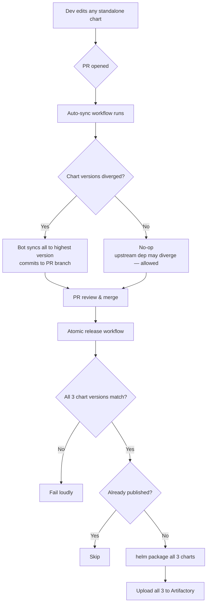

# Plan: Standalone Charts Version Sync

| Field | Value |
|-------|-------|
| Status | in-progress |
| Created | 2026-04-15 |
| Ticket | N/A |
| Branch | chore/standalone-charts-sync-automation |

## Context

The 3 standalone Helm charts (`otel-linux-standalone`, `otel-windows-standalone`, `otel-macos-standalone`) are released independently today, with no enforcement that their versions stay in sync. The integration definitions pin a single chart version per revision (e.g., `v0.3.0+0.0.19`) and the integrations-service uses that version when running `helm template` for any OS — so divergence breaks integrations for whichever OS doesn't have the pinned version published. Goal: enforce all 3 charts always release together at the same version, and remove the burden from devs to remember updating siblings.

## Architecture Decisions

- **Lockstep release:** Replace 3 independent release workflows with one atomic release workflow that publishes all 3 charts together at the shared version. — Guarantees integrations-service can pin one chart version per definition revision and find it for all 3 OSes.
- **Auto-sync chart versions on PR:** Bot commits a sync to the PR branch when devs bump only one chart's `.version`. — Removes the cognitive burden from devs without sacrificing safety.
- **No auto-bump on source-only changes:** If a dev edits source without bumping the version, the bot does nothing. The dev decides if the change warrants a release. — Avoids opinionated bumps for trivial edits (e.g. comments).
- **Highest-wins sync rule:** When chart versions diverge, all are bumped to the highest. — Predictable, matches release intent (someone bumped because they want a release).
- **Allow upstream dep version divergence:** The `opentelemetry-collector` dependency version may differ across the 3 charts. — Real need: an upstream regression on one OS shouldn't block the others. Backend `helm template` handles each chart's bundled dep independently.
- **Idempotent release:** Skip publish if the chart version already exists in Artifactory. — Safe for re-pushes after revert/replay.
- **Render-gated release:** All 3 charts must render successfully (`helm template`) before any of them publishes. If any chart fails to render, nothing publishes and the integration-definitions sync does not run. — Prevents broken charts from reaching users.
- **No backend or UI changes needed:** The existing single-chart-version model in integrations-service and integration-definitions works once chart versions are lockstep.

## Diagrams

## Milestones Overview

1. **Lockstep release** — Replace 3 independent release workflows with one atomic release that publishes all 3 charts together at the shared chart version
2. **Chart version drift prevention** — PR-time check fails the build if standalone chart versions diverge (upstream dep version may diverge — allowed)
3. **Auto-sync (zero dev burden)** — Bot syncs sibling chart versions when devs bump only one chart's version

---

## Milestone 1: Lockstep release

After this milestone, any push to master touching any standalone chart triggers one workflow that verifies chart version consistency, packages all 3 charts, and publishes them atomically to Artifactory. The 3 separate per-chart workflows are removed.

### 1.1 [x] Add atomic release workflow *(completed 2026-04-15)*
- **Files:** `.github/workflows/otel-standalone-charts-release.yml` (new)
- **What:** Create a workflow that triggers on push to master with paths matching any of the 3 standalone charts. The workflow must: (a) read all 3 `Chart.yaml` `.version` fields and fail if they don't match, (b) skip publishing if all 3 are already in Artifactory at that version (idempotency), (c) run `helm dependency build` + `helm lint` + `helm template <release> <chart>` for all 3 charts (fail-fast — render check; if any chart fails to render, nothing publishes), (d) run `helm package` for all 3 charts, (e) upload all 3 `.tgz` artifacts to Artifactory. Reuse the same Artifactory URL, username, and credential secret as the existing per-chart workflows. Do not check upstream dep version consistency — that's allowed to diverge.
- **Acceptance:** Pushing a no-op change to master with all 3 versions matching results in either (a) a successful publish of all 3, or (b) a skip notice if already published. Mismatched chart versions fail the workflow with a clear error. A chart with a broken template (e.g. invalid Helm syntax) fails the render step and prevents ALL 3 from publishing.
- **Dependencies:** None

### 1.2 [ ] Remove per-chart release workflows
- **Files:** `.github/workflows/otel-linux-standalone.yml` (delete), `.github/workflows/otel-windows-standalone.yml` (delete), `.github/workflows/otel-macos-standalone.yml` (delete if exists)
- **What:** Delete the 3 independent release workflows. The new atomic workflow from 1.1 replaces them. Verify no other workflow depends on these.
- **Acceptance:** `git grep` for the deleted workflow filenames returns no references. The atomic workflow from 1.1 is the only one publishing standalone charts.
- **Dependencies:** 1.1

---

## Milestone 2: Chart version drift prevention

After this milestone, any PR touching a standalone chart fails CI if the 3 chart versions don't all match. Devs cannot merge a PR that bumps only one chart's `.version`. The upstream `opentelemetry-collector` dep version is intentionally NOT checked — it may diverge per OS.

### 2.1 [ ] Add chart-version-match PR check
- **Files:** `.github/workflows/standalone-charts-version-check.yml` (new)
- **What:** Create a PR workflow triggered on changes to any of the 3 standalone chart paths. It reads all 3 `Chart.yaml` `.version` fields and fails the build with a clear error message if they don't all match. Should be a fast-running check (no helm install, no kind cluster). Use `yq` for parsing. Do NOT check upstream dep version — divergence is allowed to handle OS-specific upstream regressions.
- **Acceptance:** A PR that bumps only one chart's `.version` fails this check. A PR that bumps all 3 to the same version passes. A PR that bumps only one chart's upstream dep version (without changing `.version`) passes the check.
- **Dependencies:** None

### 2.2 [ ] Add render check for all 3 charts
- **Files:** `.github/workflows/standalone-charts-render-check.yml` (new)
- **What:** Create a PR workflow triggered on changes to any standalone chart. Use a matrix over the 3 charts and for each: run `helm dependency build` + `helm lint` + `helm template`. Fails the PR if any chart fails to render. This catches broken chart changes before merge — independent from the release-time render check in 1.1, which is the safety net.
- **Acceptance:** A PR introducing a Helm template syntax error in any standalone chart fails this check. A clean PR passes.
- **Dependencies:** None

---

## Milestone 3: Auto-sync (zero dev burden)

After this milestone, devs can bump only one chart's `.version` — a bot commits the sibling bumps to the PR branch automatically. The version-match check from Milestone 2 then passes without dev intervention. Source-only edits do NOT trigger any auto-bump (the dev decides if a release is warranted).

### 3.1 [ ] Add auto-sync workflow
- **Files:** `.github/workflows/auto-sync-standalone-charts.yml` (new)
- **What:** Create a PR workflow with `permissions: contents: write` that runs on changes to any standalone chart path. Logic: (a) read all 3 chart `.version` fields, (b) if they match, no-op (regardless of source-only changes — devs control whether to bump), (c) if they diverge, sync all to the highest version. After mutation, commit + push to the PR branch as `github-actions[bot]` with message `chore: auto-sync standalone chart versions to <version>`. Skip the workflow for forked-repo PRs (cannot push to forks). Use `yq` for version mutation. Do NOT touch the upstream `opentelemetry-collector` dep version.
- **Acceptance:** (a) PR bumping only Linux from `0.0.20` → `0.0.25` → bot commits Windows + Mac to `0.0.25`. (b) PR with all 3 in sync at same version → workflow no-ops (even if values.yaml changed). (c) PR editing only one chart's source files without a version bump → workflow no-ops; dev may manually bump if the change is release-worthy. The version-match PR check from 2.1 passes after the bot commit.
- **Dependencies:** 2.1

### 3.2 [ ] Document the workflow in CONTRIBUTING (if exists)
- **Files:** `CONTRIBUTING.md` or `README.md` (whichever exists at repo root)
- **What:** Add a short section explaining: (a) the 3 standalone chart `.version` fields are kept in sync automatically — devs can bump one and the others follow, (b) source-only changes don't auto-bump — devs decide when a release is warranted, (c) the upstream `opentelemetry-collector` dep version may diverge per OS to handle upstream regressions, (d) the PR check and release workflow as safety nets. Keep it brief (10-20 lines).
- **Acceptance:** A new contributor reading the doc understands they don't need to manually bump all 3 charts and knows when to manually bump vs. when to let the bot handle it.
- **Dependencies:** 3.1

---
